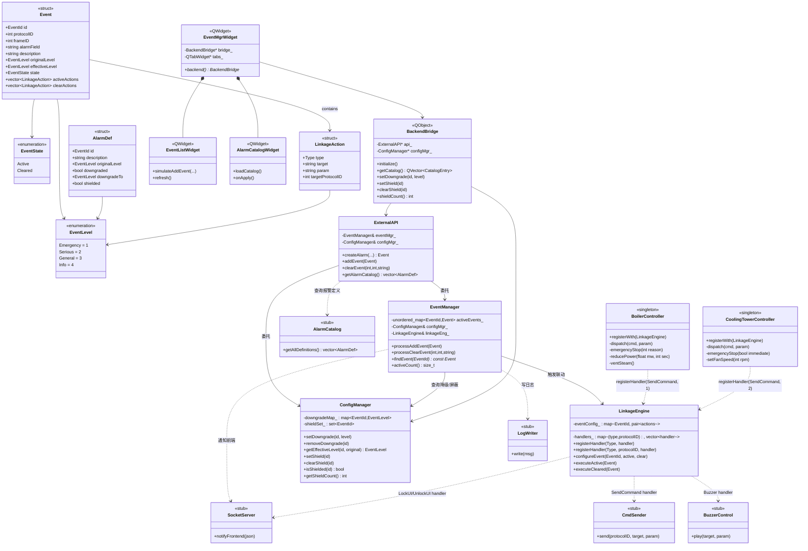
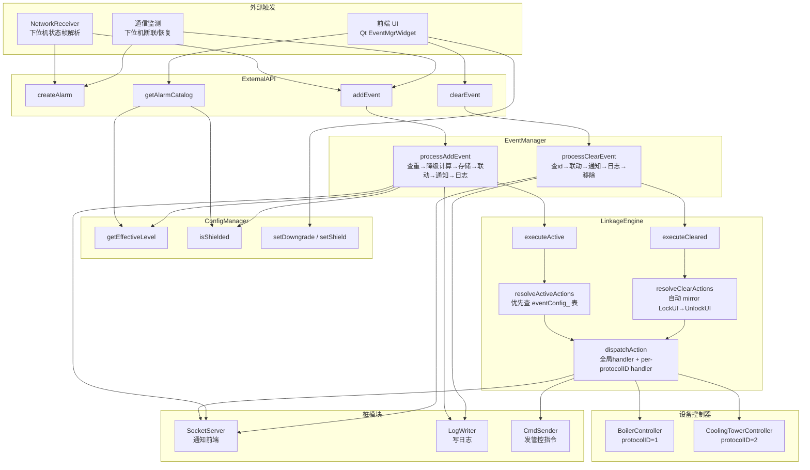
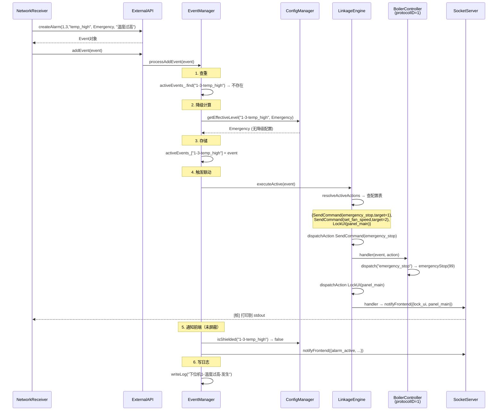
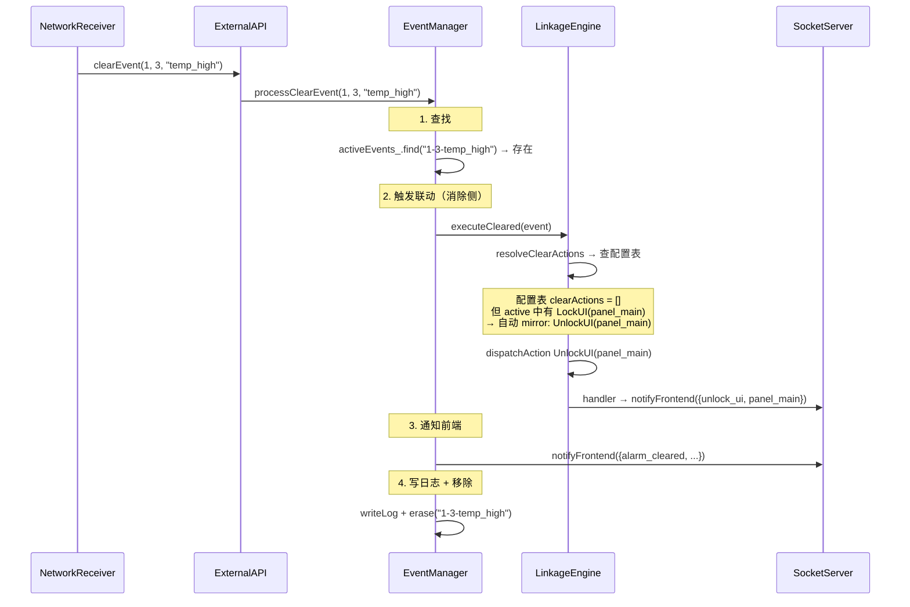
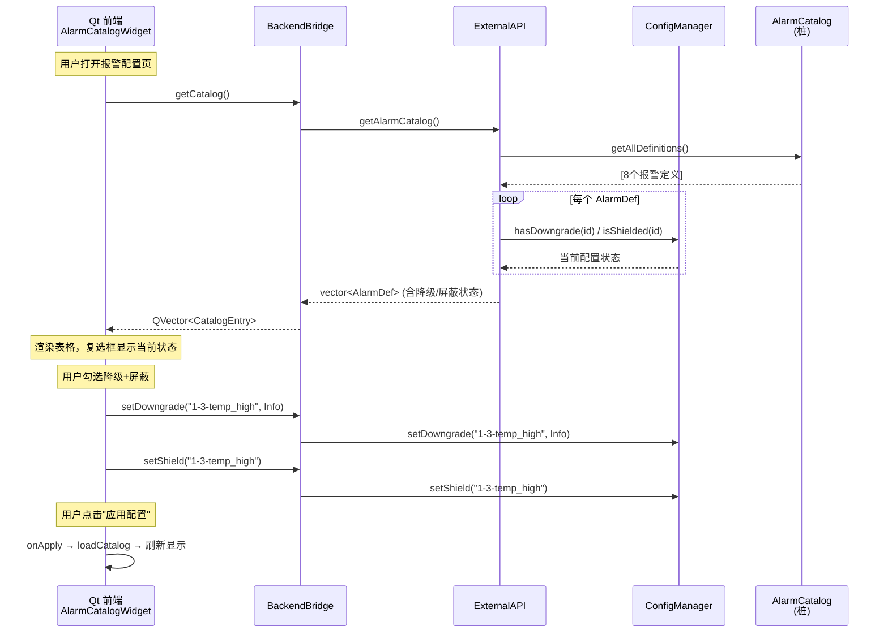
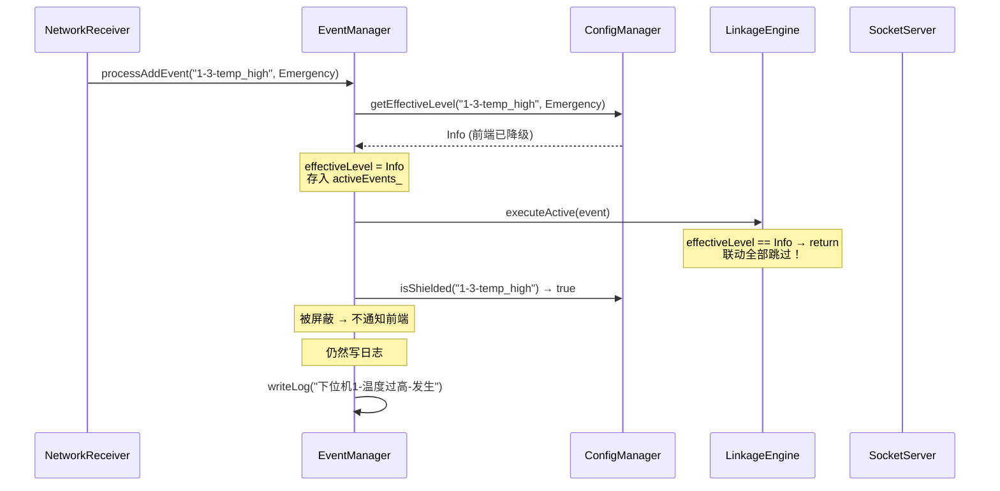
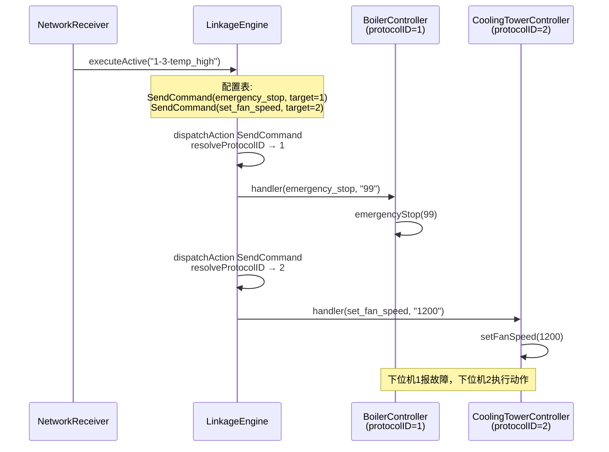

# 事件管理中心 — 架构图

> 基于 v4 设计方案，Mermaid 语言绘制

---

## 1. 类图

---

## 2. 调用关系图

---

## 3. 时序图

### 3.1 告警产生

### 3.2 告警消除（自动 mirror UnlockUI）

### 3.3 前端事前配置（降级/屏蔽）

### 3.4 降级为提示后报警产生（不联动）

### 3.5 跨设备联动

