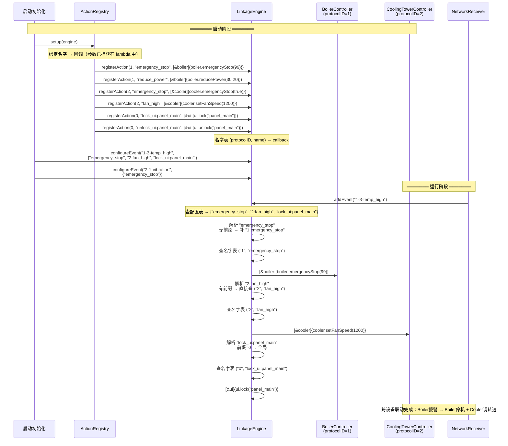

# ActionRegistry 方案 — 调用关系

> 讨论日期：2026-06-26

## 核心变化

| v4 当前 | ActionRegistry 方案 |
|---------|-------------------|
| `LinkageAction{type, target, param, targetProtocolID}` | 名字字符串 `"1:emergency_stop"` |
| 每个控制器写 `dispatch(cmd, param)` if-else | 控制器只暴露 public 方法 |
| `registerHandler(type, protocolID, handler)` | `registerAction(protocolID, name, callback)` |
| `configureEvent(id, vector<LinkageAction>)` | `configureEvent(id, vector<string>)` |

## 注册与调用流程



## 引擎内部结构

```mermaid
graph TD
    subgraph LinkageEngine 内部
        A[eventConfig_<br/>EventId → vector&lt;string&gt;]
        B[actionTable_<br/>(protocolID, name) → callback]
        C{resolveName<br/>event, "name"}
    end

    E1["configureEvent(<br/>'1-3-temp_high',<br/>{emergency_stop, 2:fan_high})"]
    E2["registerAction(<br/>1, emergency_stop,<br/>[&boiler]{...})"]
    E3["registerAction(<br/>2, fan_high,<br/>[&cooler]{...})"]

    E1 --> A
    E2 --> B
    E3 --> B

    D1["addEvent('1-3-temp_high')"] --> A
    A -->|"{emergency_stop, 2:fan_high}"| C
    C -->|"1:emergency_stop"| B
    C -->|"2:fan_high"| B
    B -->|callback| D2[执行]
```

## resolveName 逻辑

```
输入: event.protocolID=1, name="emergency_stop"

if name 包含 ':'
    → 直接拆分: (prefix, localName)
else
    → prefix = event.protocolID, localName = name

查 actionTable_[(prefix, localName)] → callback()
```

## 与 v4 方案对比

| | v4 (LinkageAction) | ActionRegistry |
|------|------|------|
| 定义动作 | `LinkageAction{SendCommand, "emergency_stop", "99", 1}` | `"emergency_stop"` |
| 注册回调 | `registerHandler(SendCommand, 1, handler)` | `registerAction(1, "emergency_stop", callback)` |
| 控制器代码 | `registerWith()` + `dispatch(cmd, param)` | 只暴露 public 方法 |
| 跨设备 | `targetProtocolID` 字段 | `"2:fan_high"` 名字前缀 |
| 配置事件 | `configureEvent(id, vector<LinkageAction>)` | `configureEvent(id, vector<string>)` |
| 自动 mirror | resolveClearActions 查 LockUI 类型 | `lock_ui:xxx` / `unlock_ui:xxx` 成对名字 |
