# 事件管理中心架构与行为图

## 1. 图例与边界

| 项目 | 内容 |
|---|---|
| 文档 ID | `EventMgr-AD-20260721` |
| 版本 | `1.2` |
| 日期 | 2026-07-23 |
| 状态 | 当前实现审计基线（架构与行为图） |
| 审计源码基线 | `89dad8b` |
| 当前需求基线 | [事件管理中心当前需求基线](./2026-07-21-software-requirements-baseline.md) |
| 概要设计 | [事件管理中心概要设计](./2026-07-21-high-level-design.md) |
| 详细设计 | [事件管理中心详细设计](./2026-07-21-detailed-design.md) |
| 证据范围 | 根目录 `main.cpp`，`backend/`、`backend/stubs/`、`frontend/` 中的当前 `.h/.cpp` |

本文只表达审计源码基线中已经存在的类、方法与调用。标有“桩”的节点只代表当前仓库中的占位实现。时序图中的“源码后续顺序”表示代码文本规定的逻辑顺序，不等于默认 GUI 同线程路径能够运行到该位置。

不同图型的箭头含义分别如下，不能跨图型套用：

- **UML 类图**：实线关联表示成员引用、实际持有或 Qt parent-child；`*--` 只用于源码中确实存储的值或拥有对象；虚线依赖表示创建、注册、直接/静态方法调用或返回类型依赖。
- **流程图**：实线表示当前进程内直接调用或委托；虚线表示信号、callback、注册或条件性创建/调用。边标签说明条件，例如 `fallback_ 已设置`。
- **时序图**：实线消息表示同步调用，虚线返回表示返回或异步入池；`opt`/`alt` 明确可选或互斥路径。

本轮图表重建的讨论、评审和验证过程已收入完成并审查的[文档讨论与验证记录](./2026-07-21-documentation-discussion-record.md)，图表与全量交付检查见其[最终验证结果](./2026-07-21-documentation-discussion-record.md#112-task-8-验证结果)。并发、生命周期和错误边界的文字依据见[详细设计第 9 节](./2026-07-21-detailed-design.md#core-algorithms)、[第 10 节](./2026-07-21-detailed-design.md#ownership-lifetime)、[第 11 节](./2026-07-21-detailed-design.md#concurrency-matrix)和[第 12 节](./2026-07-21-detailed-design.md#error-boundaries)。

**目录**

- [1. 图例与边界](#legend-boundary)
- [2. 类图](#class-views)：[总体关系](#class-overview)、[后端与领域](#class-backend-domain)、[前端与桥接](#class-frontend-bridge)
- [3. 调用关系图](#call-views)：[事件生命周期](#call-event-lifecycle)、[查询与配置](#call-query-config)
- [4. 模块初始化时序图](#sequence-init)
- [5. 设备告警产生时序图](#sequence-active)
- [6. 告警消除时序图](#sequence-clear)
- [7. 降级与屏蔽配置时序图](#sequence-config)
- [8. 联动动作异步执行时序图](#sequence-async)

## 2. 类图

### 2.1 总体关系

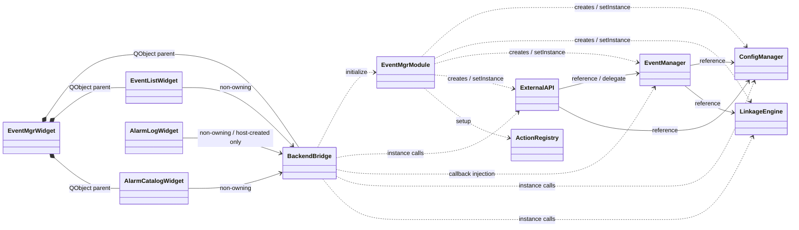

此图只显示模块边界。`AlarmLogWidget` 是可独立嵌入控件，当前 `EventMgrWidget::setupUI()` 不创建它。

### 2.2 后端与领域类型

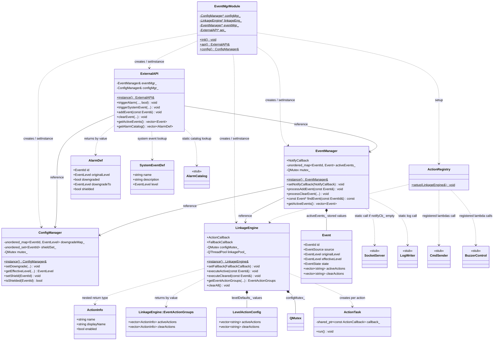

`EventManager *-- Event` 表示哈希表确实存储 `Event` 值；其他返回值类型只用虚线依赖。四个后端对象由静态模块启动且没有 shutdown。

### 2.3 前端与桥接类型

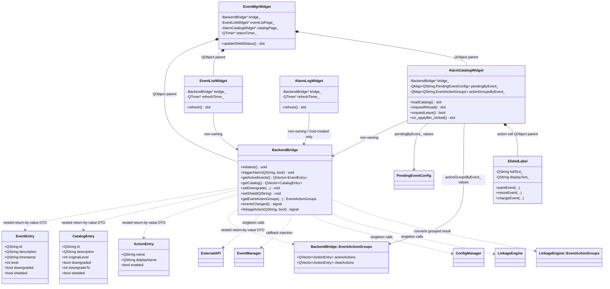

三个 DTO 是 `BackendBridge` 的嵌套类型并按值临时返回，虚线只表示类型依赖，不表示桥接长期存储或拥有 DTO。默认容器只拥有桥接、事件列表和目录页；日志控件需宿主另行创建。

## 3. 调用关系图

### 3.1 事件生命周期与通知

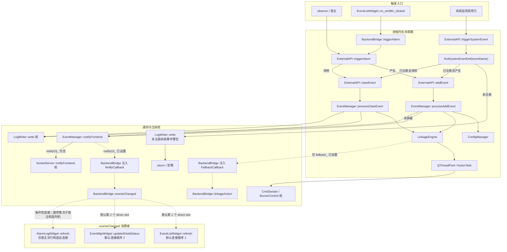

系统事件在产生/消除分流前先执行 `findSystemEventDef()`；未注册名称只写警告并返回，不进入事件生命周期。GUI 初始化会设置 fallback；根目录后端演示只调用 `EventMgrModule::init()`，不创建 `BackendBridge`，因此 `fallback_` 保持空。默认 `EventMgrWidget` 仅连接列表刷新后再连接状态刷新；同线程发射时，第一个槽重入事件锁并死锁，当前这次发射不会继续到状态槽。`AlarmLogWidget` 不在默认容器中；宿主若另行创建，它在自身构造函数中连接，连接顺序取决于构造时机。

### 3.2 查询与配置

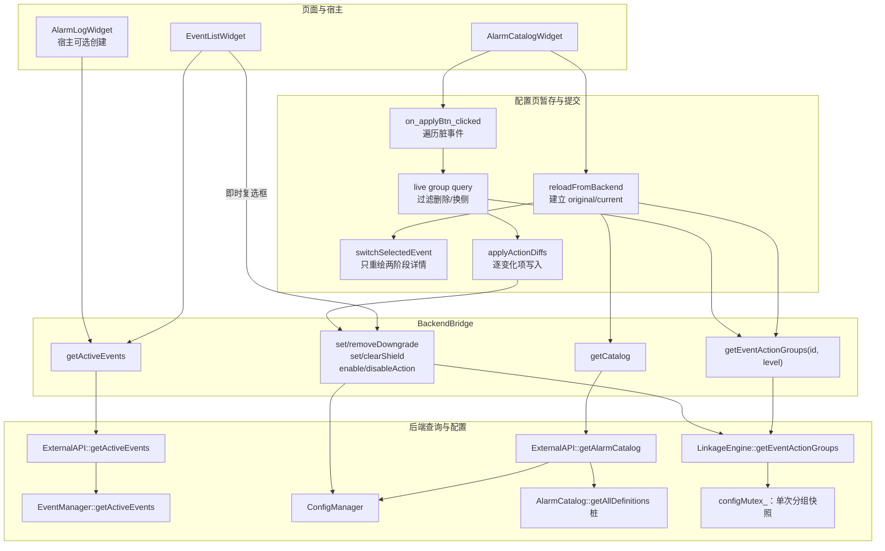

活跃查询返回 `Event` 副本，再由桥接映射为 `EventEntry`。配置页为每个目录事件实际调用分组查询并缓存两阶段 DTO；应用前再次查询 live membership，再通过多个独立写接口提交差异。该流程 best-effort 保留未触碰变化，但不是事务且没有回滚。

## 4. 模块初始化时序图

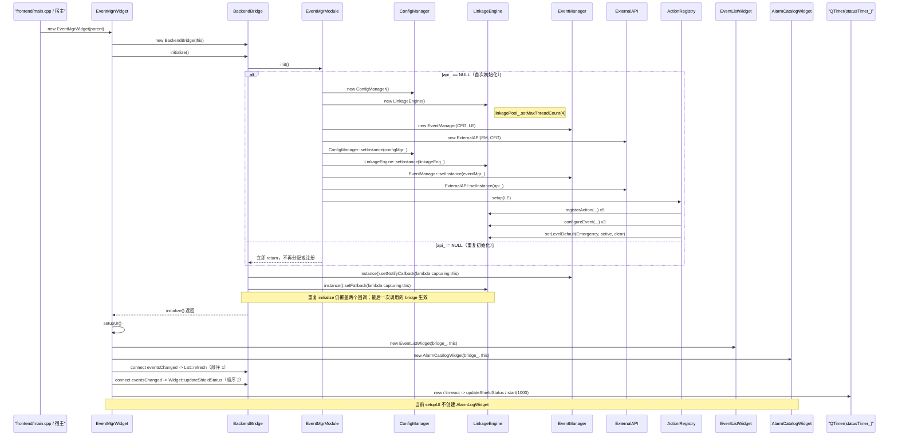

**解释与风险**：`api_` 检查无同步，不能作为并发安全的一次性初始化。重复调用只跳过四个对象的分配和 `ActionRegistry::setup()`，不会跳过桥接回调覆盖。默认 `eventsChanged` 连接在页面构造之后由 `EventMgrWidget` 依次建立，而不是由 `EventListWidget` 构造函数建立。lambda 捕获裸 `this`，析构不解绑；模块也没有 shutdown、delete 或单例槽复位流程，因此存在悬空回调、泄漏式进程生命周期和“最后 bridge 赢”行为。

## 5. 设备告警产生时序图

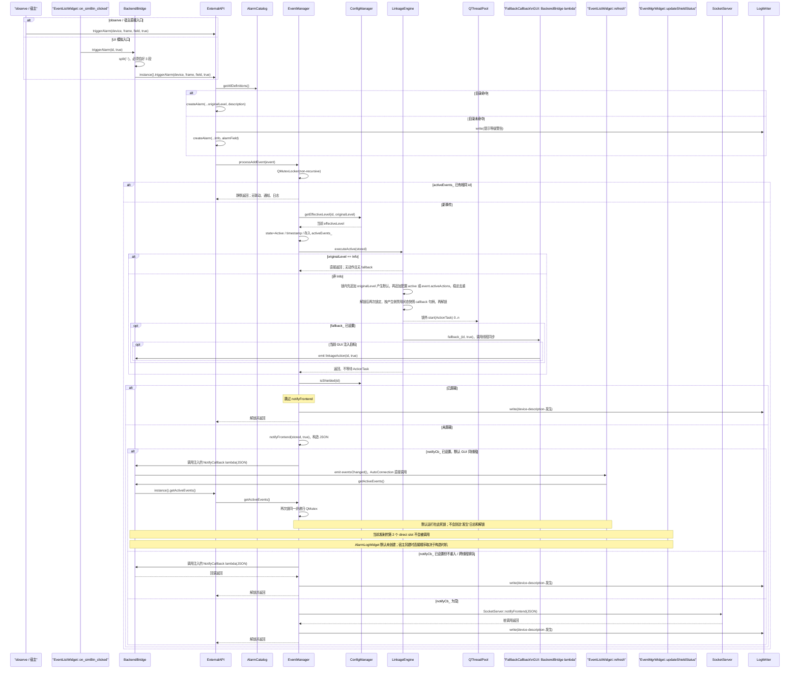

**解释与风险**：图严格区分源码逻辑顺序与默认运行停点。有效等级只在加入时计算并保存；联动等级默认仍按 `originalLevel`。fallback 只有 `fallback_` 已设置时才同步调用；GUI 桥接会注入发射 `linkageAction` 的 lambda，根目录后端演示不注入。产生侧屏蔽只抑制通知，不抑制入表、联动和源码后续日志。默认容器先连接 `EventListWidget::refresh`，再连接 `EventMgrWidget::updateShieldStatus`；第一个 direct slot 重入死锁后，本次发射到不了第二个槽。`AlarmLogWidget` 默认不存在，宿主另行创建时才成为消费者。若通知回调不重入、跨线程连接实际排队，或没有通知回调而走 `SocketServer` 桩，源码后续顺序才可完成。

## 6. 告警消除时序图

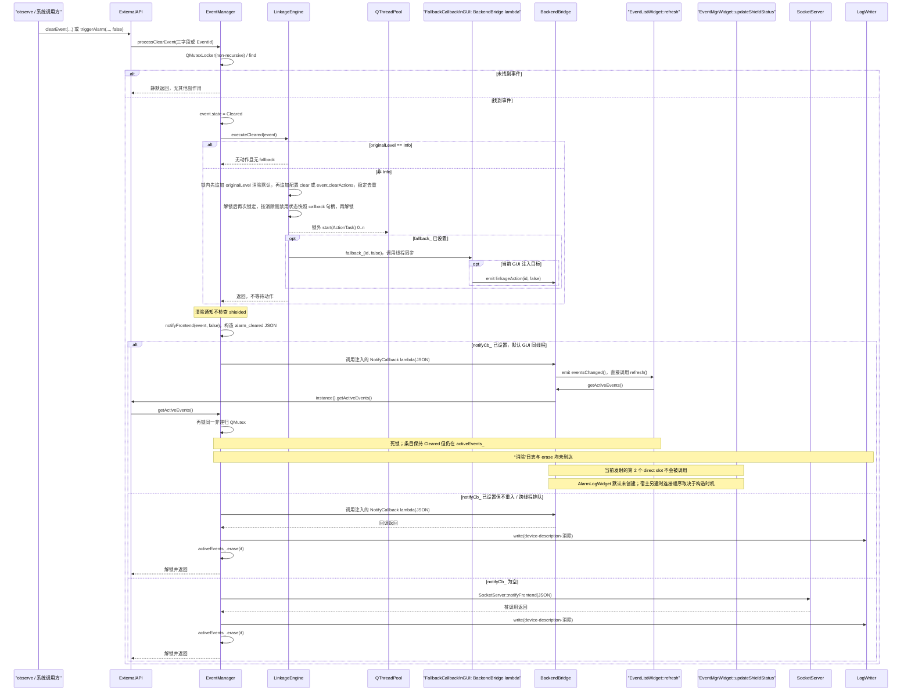

**解释与风险**：清除联动的 fallback 同样只在 `fallback_` 已设置时同步调用。清除命中后，无论事件是否屏蔽都同步通知。默认同线程 UI 在第一个连接的列表刷新中重入查询并停止；状态槽不会在本次发射中执行，事件已被改成 `Cleared`，但尚未写日志和删除。宿主另行创建的 `AlarmLogWidget` 也会连接 `eventsChanged`，其相对顺序由构造时机决定。只有无重入的通知路径才会完成“联动调度 -> 通知 -> 日志 -> erase”的源码顺序。两个 `processClearEvent` 重载在锁内行为相同。

## 7. 配置暂存、统一应用与离开保护时序图

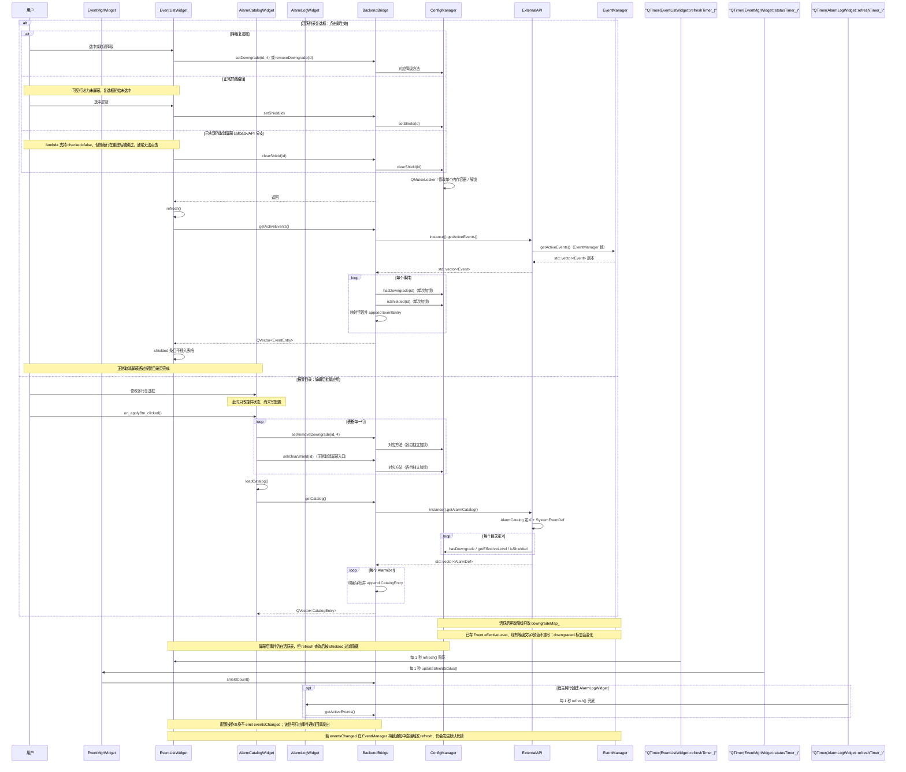

上图保留活跃列表即时降级/屏蔽路径；配置中心的当前暂存与离开保护路径如下：

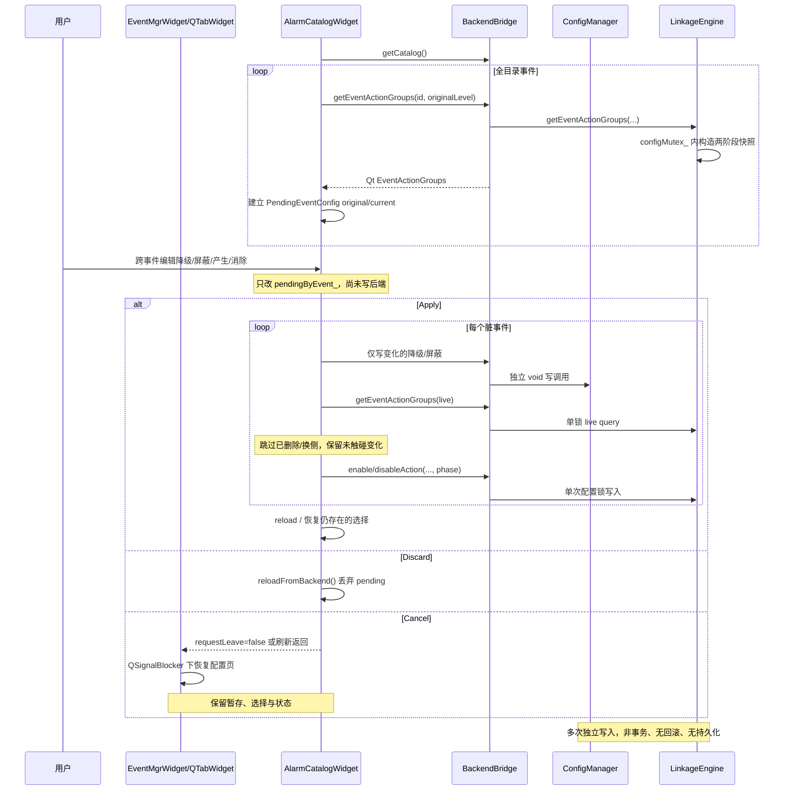

`dirtyPromptActive_` 阻止消息框嵌套事件循环中的重复确认。“统一应用”只表示一次用户动作遍历全部脏事件，不表示事务提交。

## 8. 产生侧与消除侧联动异步执行时序图

### 8.1 产生侧

### 8.2 消除侧

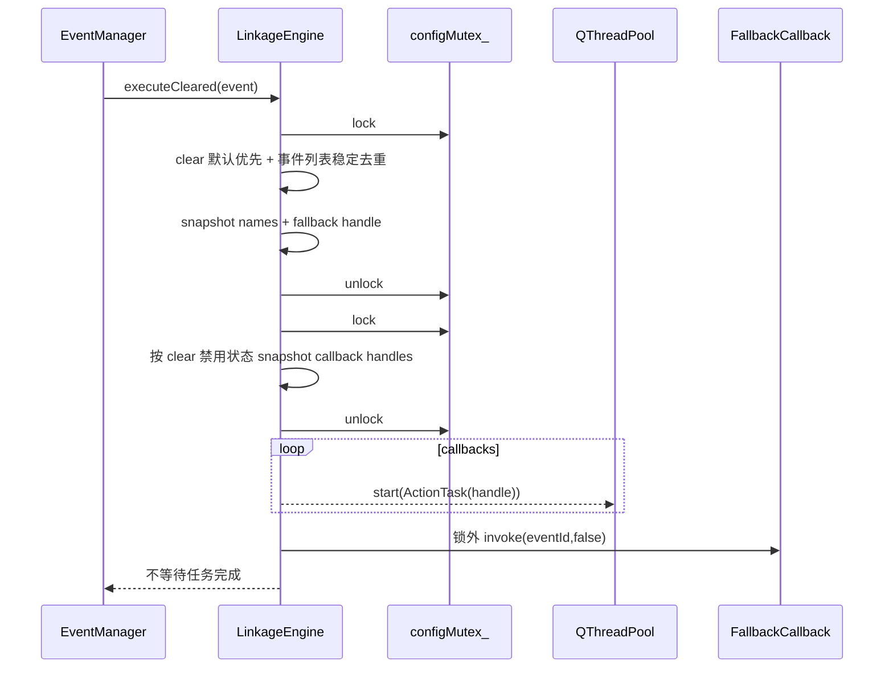

### 8.3 共用调度与关闭边界

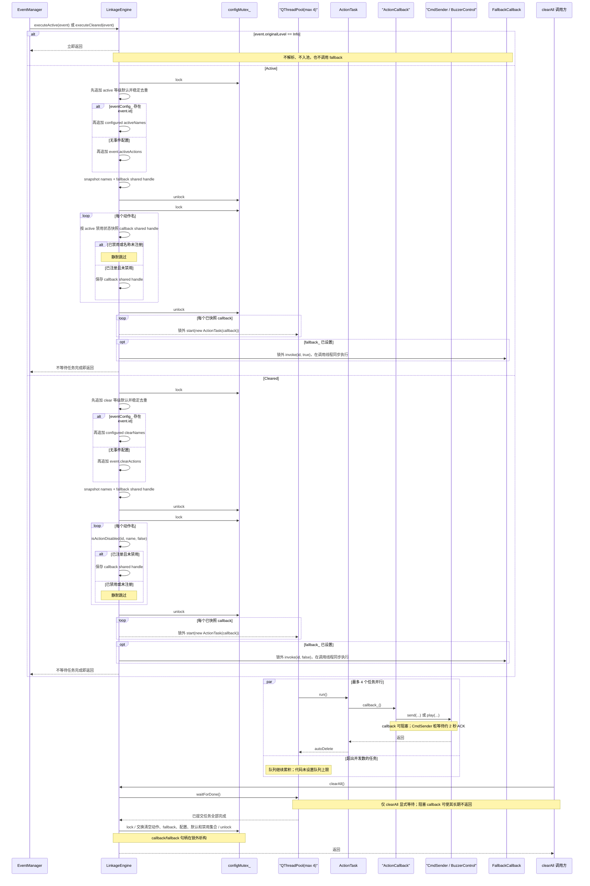

**解释与风险**：产生和消除侧都按“对应等级默认优先、事件列表随后、首次出现保留”的规则解析。名称/fallback 与 callback/禁用状态分别在两个配置锁临界区快照，因此支持并发读写但不是单一事务版本。任务和 fallback 均在引擎配置锁外调用；上层 `EventManager` 仍持有自身事件锁。线程池没有背压、队列上限、超时、取消或结果聚合。`clearAll()` 仅限调用方已停止新执行并等待在途 `execute*()` 返回的关闭/测试边界。
