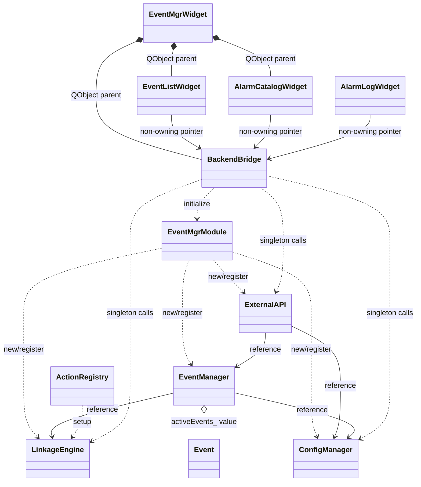
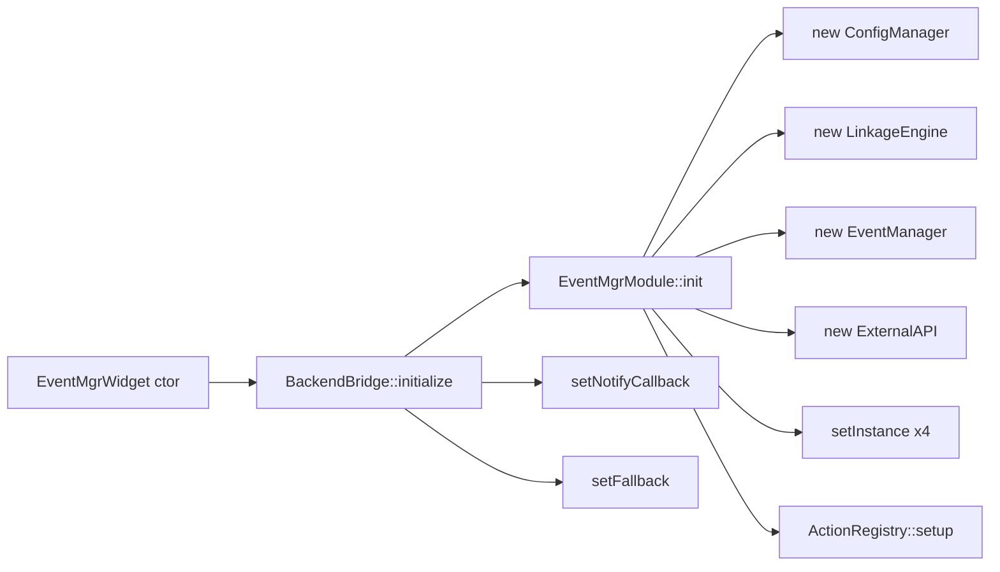
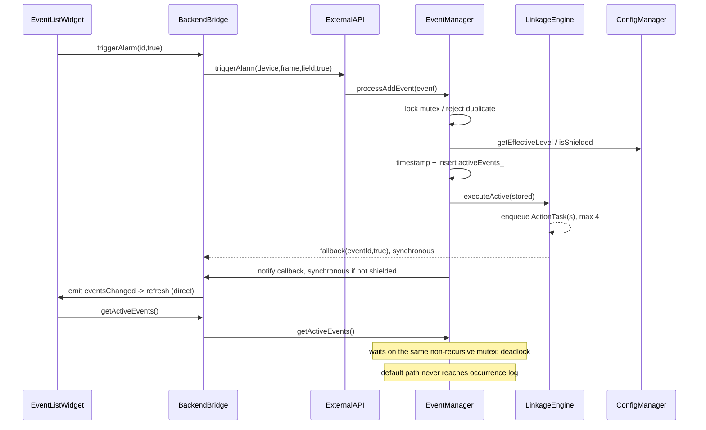
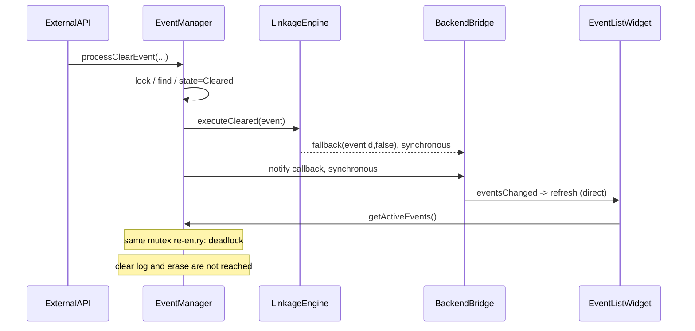

# 事件管理中心详细设计

<a id="doc-metadata"></a>
## 1. 文档元数据

| 项目 | 内容 |
|---|---|
| 文档 ID | `EventMgr-DD-20260721` |
| 版本 | `1.2` |
| 日期 | 2026-07-21 |
| 状态 | 当前实现基线（详细设计） |
| 审计源码基线 | `9a24bda74cde1b41ded65d858e4f89d92162a9be`（需求文档提交时、后续文档任务之前的代码快照） |
| 当前需求基线 | [事件管理中心当前需求基线](./2026-07-21-software-requirements-baseline.md)，提交 `9a24bda74cde1b41ded65d858e4f89d92162a9be` |
| 概要设计 | [事件管理中心概要设计](./2026-07-21-high-level-design.md)，提交 `9d0bdd0f347df42dd6d2319a666a1dc59028814b` |
| 证据范围 | 仓库根 `main.cpp`，以及 `backend/`、`backend/stubs/`、`frontend/` 的 `.h/.cpp/.ui/.pro` 文件 |

本文描述上述源码基线的实际结构与行为，不把历史文档中的设想、源码注释中的未来方向或桩接口扩展成已实现能力。文中的“线程安全”仅表示明确受锁保护的范围。

<a id="revision-review"></a>
### 1.1 修订与评审记录

| 版本 | 日期 | 记录 |
|---|---|---|
| `1.0` | 2026-07-21 | 建立当前实现详细设计，覆盖模块、接口、数据流、并发、所有权和构造/析构审计 |
| `1.1` | 2026-07-21 | 补齐公开值构造、删除复制操作、嵌套 DTO 及根目录后端演示构建证据 |
| `1.2` | 2026-07-21 | 接受并纳入质量评审意见：增加稳定目录/追踪链接、依赖权威边界、公开类型索引并消除接口表歧义 |

本轮质量评审发现已经接受并体现在本文。代码层面的构造/析构补齐、锁范围调整、生命周期治理、协议转义和生产桩替换均不在本次文档修改范围内，延期为后续代码提案；相关讨论、方案比较与确认过程应写入计划中的[文档讨论与验证记录](./2026-07-21-documentation-discussion-record.md)。该记录在 Task 6 完成前状态为**计划新增**，本文不把尚未存在或尚未完成的记录写成现有证据。

<a id="toc"></a>
## 目录

- [1. 文档元数据与评审记录](#doc-metadata)
- [2. 详细设计总览](#design-overview)
- [3. 数据类型详细设计](#data-types)：[基础事件类型](#type-event-level)、[事件值](#type-event)、[联动 DTO](#type-action-info)、[桥接 DTO](#type-event-entry)、[公共类型索引](#public-type-index)
- [4. 后端模块详细设计](#backend-modules)：[EventMgrModule](#module-event-mgr)、[ExternalAPI](#module-external-api)、[EventManager](#module-event-manager)、[ConfigManager](#module-config-manager)、[LinkageEngine](#module-linkage-engine)、[ActionRegistry](#module-action-registry)、[system_events](#module-system-events)
- [5. 外部桩详细设计](#stub-modules)：[AlarmCatalog](#stub-alarm-catalog)、[SocketServer](#stub-socket-server)、[LogWriter](#stub-log-writer)、[CmdSender](#stub-cmd-sender)、[BuzzerControl](#stub-buzzer-control)
- [6. 前端模块详细设计](#frontend-modules)：[BackendBridge](#frontend-backend-bridge)、[EventMgrWidget](#frontend-event-mgr-widget)、[EventListWidget](#frontend-event-list-widget)、[AlarmCatalogWidget](#frontend-alarm-catalog-widget)、[AlarmLogWidget](#frontend-alarm-log-widget)
- [7. 公开接口汇总](#public-api)
- [8. 数据格式](#data-formats)
- [9. 核心算法与调用关系](#core-algorithms)
- [10. 所有权与生命周期矩阵](#ownership-lifetime)
- [11. 并发矩阵](#concurrency-matrix)
- [12. 错误与边界行为](#error-boundaries)
- [13. 构造与析构合规审计](#ctor-dtor-audit)
- [14. 构建与演示集成](#build-integration)
- [15. 需求追踪](#requirements-trace)

<a id="design-overview"></a>
## 2. 详细设计总览

当前程序是 Qt 单进程应用。`EventMgrWidget` 创建 `BackendBridge`，桥接初始化四个进程期后端对象。设备或系统事件经 `ExternalAPI` 进入 `EventManager`；后者在同一把非递归 `QMutex` 的临界区内完成入表/改状态、联动调度、同步通知和日志调用。联动动作由 `LinkageEngine` 私有线程池异步执行，但 fallback 在调用线程同步执行。



<a id="data-types"></a>
## 3. 数据类型详细设计

<a id="type-event-level"></a>
### 3.1 `EventLevel`

- **职责**：表示原始或有效告警等级；数值固定为 `Emergency=1`、`Serious=2`、`General=3`、`Info=4`。
- **源文件**：`backend/event_types.h`。
- **构造与析构**：`enum class`，不声明构造函数或析构函数，不适用类实例生命周期规则。
- **公开接口**：四个枚举常量；代码以 `static_cast<int>` 与 UI 整数互转。
- **关键成员及所有权**：无成员、无所有权。
- **处理流程**：`ExternalAPI` 设置 `originalLevel`；加入活跃表时 `ConfigManager` 计算 `effectiveLevel`；`LinkageEngine` 始终用 `originalLevel` 判断联动。
- **并发与线程安全**：值类型本身无共享状态。
- **失败与边界行为**：`ConfigManager::setDowngrade()` 拒绝枚举数值范围 1 至 4 之外的值；桥接直接强转任意 `int`，校验发生在配置层。

<a id="type-event-state"></a>
### 3.2 `EventState`

- **职责**：表示 `Active`/`Cleared` 两状态。
- **源文件**：`backend/event_types.h`。
- **构造与析构**：`enum class`，无构造/析构声明。
- **公开接口**：两个枚举常量。
- **关键成员及所有权**：无。
- **处理流程**：事件默认和加入时为 `Active`；清除命中后先改为 `Cleared`，正常源码路径末尾再从活跃表删除。
- **并发与线程安全**：活跃表内状态读写由 `EventManager::mutex_` 保护；表外副本不受其保护。
- **失败与边界行为**：默认 UI 清除通知可死锁，届时表内对象已是 `Cleared` 但尚未删除。

<a id="type-event-source"></a>
### 3.3 `EventSource`

- **职责**：区分 `Device` 和 `System` 来源。
- **源文件**：`backend/event_types.h`。
- **构造与析构**：`enum class`，无构造/析构声明。
- **公开接口**：两个枚举常量。
- **关键成员及所有权**：无。
- **处理流程**：`Event` 默认是 `Device`；两个系统事件入口显式改为 `System`。
- **并发与线程安全**：值类型无共享状态。
- **失败与边界行为**：来源当前不参与路由、联动或展示判断。

<a id="type-event-id"></a>
### 3.4 `EventId`

- **职责**：作为事件唯一键；是 `std::string` 类型别名。
- **源文件**：`backend/event_types.h`。
- **构造与析构**：沿用 `std::string`，本模块没有独立构造/析构。
- **公开接口**：设备 ID 为 `deviceName-frameID-alarmField`；纯系统 ID 为 `eventName`；关联设备系统 ID 为 `deviceName-0-eventName`。
- **关键成员及所有权**：值语义字符串，由持有者拥有。
- **处理流程**：创建、查重、清除定位、配置映射和联动禁用均使用该字符串。
- **并发与线程安全**：单个副本按值使用；共享容器安全性取决于所属模块。
- **失败与边界行为**：`-` 未转义。后端完整 ID 清除只取前两个连字符，前端模拟入口则要求拆分后恰好三段；二者对含连字符输入的行为不一致。

<a id="type-alarm-def"></a>
### 3.5 `AlarmDef`

- **职责**：承载目录行的 ID、描述、原始等级、降级与屏蔽状态。
- **源文件**：`backend/event_types.h`；设备数据由 `backend/stubs/alarm_catalog.cpp` 创建。
- **构造与析构**：显式内联默认构造函数，将等级设为 `Info`、两个布尔值设为 `false`；未显式声明析构、复制构造或赋值，均由编译器隐式生成。
- **公开接口**：公开数据字段，无成员方法。
- **关键成员及所有权**：字符串和值字段均由结构体拥有。
- **处理流程**：目录桩生成设备定义，`ExternalAPI::getAlarmCatalog()` 追加系统定义并合并内存配置状态。
- **并发与线程安全**：按值返回；合并配置时每次查询分别由 `ConfigManager` 加锁，不是跨条目的事务快照。
- **失败与边界行为**：目录内容是静态桩；默认构造对象的 ID/描述为空。

<a id="type-system-event-def"></a>
### 3.6 `SystemEventDef`

- **职责**：描述允许触发的系统事件名、文本和等级。
- **源文件**：`backend/event_types.h`、`backend/system_events.cpp`。
- **构造与析构**：显式内联默认构造函数和三参数构造函数；析构、复制构造和赋值均隐式生成。
- **公开接口**：公开字段及两个构造函数。
- **关键成员及所有权**：自身拥有两个字符串和值等级。
- **处理流程**：文件静态常量向量构造五个示例定义，按名称线性查找。
- **并发与线程安全**：定义表初始化后只读；返回的引用/指针指向进程期静态向量。
- **失败与边界行为**：未找到返回 `NULL`；调用方记录警告并忽略触发。

<a id="type-event"></a>
### 3.7 `Event`

- **职责**：自包含事件值，保存身份、来源、等级、状态、时间及联动兜底字段。
- **源文件**：`backend/event_types.h`。
- **构造与析构**：显式内联默认构造函数，默认 `Device`、帧号 0、两个等级 `Info`、状态 `Active`；析构、复制构造和赋值隐式生成。
- **公开接口**：公开数据字段，无成员方法。
- **关键成员及所有权**：拥有所有字符串和两个动作名称向量；`EventManager` 在哈希表中持有副本。
- **处理流程**：由工厂或系统入口填充；加入时复制并重算有效等级/时间；联动配置缺失时才读取动作兜底字段。
- **并发与线程安全**：值副本独立；表内实例由事件锁保护，但 `findEvent()` 把内部指针暴露到解锁后。
- **失败与边界行为**：调用 `addEvent()` 可传入字段不一致的任意对象，管理器不校验 `id` 与其他字段是否匹配。

<a id="type-action-info"></a>
### 3.8 `LinkageEngine::ActionInfo`

- **职责**：向前端查询返回单个事件显式配置动作的内部名、显示名及产生/清除两侧禁用状态。
- **源文件**：`backend/linkage_engine.h`；生产逻辑位于 `backend/linkage_engine.cpp` 的 `getEventActions()`。
- **构造与析构**：未显式声明构造函数或析构函数，均由编译器隐式生成；复制特殊成员也为隐式生成。默认初始化对象时两个 `std::string` 为空，但两个 `bool` 标量成员值不确定，读取前必须赋值。
- **公开接口**：四个公开字段 `name`、`displayName`、`disabledActive`、`disabledClear`，无成员方法。
- **关键成员及所有权**：对象按值拥有两个字符串和两个布尔值；返回向量拥有对象副本。
- **处理流程**：`getEventActions()` 对每个去重名称先创建局部对象，再逐一写入四个成员，随后 `push_back`；当前生产路径不会把未赋值标量追加到结果。
- **并发与线程安全**：对象副本无共享状态；生产方法读取引擎容器时没有互斥保护。
- **失败与边界行为**：直接默认初始化后若调用方读取两个布尔值会读取不确定值；生产方法只覆盖事件显式配置动作，不包含等级默认和事件兜底动作。

<a id="type-event-entry"></a>
### 3.9 `BackendBridge::EventEntry`

- **职责**：把后端活跃 `Event` 转换为 Qt 前端使用的事件行数据。
- **源文件**：`frontend/backend_bridge.h`；生产逻辑位于 `frontend/backend_bridge.cpp` 的 `getActiveEvents()`。
- **构造与析构**：构造、析构及复制特殊成员均未显式声明，由编译器隐式生成。默认初始化时三个 `QString` 正常构造为空，`int level` 与两个 `bool` 标量成员值不确定。
- **公开接口**：公开字段 `id`、`description`、`timestamp`、`level`、`downgraded`、`shielded`，无成员方法。
- **关键成员及所有权**：按值拥有 Qt 字符串和标量；`QVector` 拥有返回副本。
- **处理流程**：桥接遍历后端事件时创建局部对象，并在 `append` 前对六个成员全部赋值；两个配置状态分别查询 `ConfigManager`。
- **并发与线程安全**：值副本无共享状态；生产过程先取得事件快照，再逐项查询配置，不构成跨模块原子快照。
- **失败与边界行为**：调用方直接默认初始化后读取三个标量属于读取不确定值；当前生产方法不存在该问题。返回顺序继承后端无序表遍历顺序。

<a id="type-catalog-entry"></a>
### 3.10 `BackendBridge::CatalogEntry`

- **职责**：把 `AlarmDef` 转换为 Qt 目录页面使用的行数据。
- **源文件**：`frontend/backend_bridge.h`；生产逻辑位于 `frontend/backend_bridge.cpp` 的 `getCatalog()`。
- **构造与析构**：构造、析构及复制特殊成员均隐式生成。默认初始化时两个 `QString` 为空，两个 `int` 与两个 `bool` 标量成员值不确定。
- **公开接口**：公开字段 `id`、`description`、`originalLevel`、`downgraded`、`downgradeTo`、`shielded`，无成员方法。
- **关键成员及所有权**：按值拥有字符串和标量，返回 `QVector` 拥有副本。
- **处理流程**：`getCatalog()` 创建局部对象，把来源定义的六个字段全部赋值后 `append`，因此当前生产路径不暴露未初始化标量。
- **并发与线程安全**：值对象本身无共享状态；目录构造的后端配置查询逐方法加锁但不是整体事务。
- **失败与边界行为**：直接默认初始化后读取四个标量会读取不确定值；生产方法的 `downgradeTo` 即使 `downgraded=false` 也从已默认初始化的 `AlarmDef` 赋为 `Info`。

<a id="type-action-entry"></a>
### 3.11 `BackendBridge::ActionEntry`

- **职责**：把联动引擎 `ActionInfo` 转换为 Qt 前端使用的动作配置数据。
- **源文件**：`frontend/backend_bridge.h`；生产逻辑位于 `frontend/backend_bridge.cpp` 的 `getEventActions()`。
- **构造与析构**：构造、析构及复制特殊成员均隐式生成。默认初始化时两个 `QString` 为空，两个 `bool` 标量成员值不确定。
- **公开接口**：公开字段 `name`、`displayName`、`disabledActive`、`disabledClear`，无成员方法。
- **关键成员及所有权**：按值拥有字符串和标量；返回 `QVector` 拥有副本。
- **处理流程**：桥接为每个 `ActionInfo` 创建局部对象，转换并写入四个成员后 `append`；当前生产路径对所有成员完整赋值。
- **并发与线程安全**：值副本无共享状态；生产方法下游读取 `LinkageEngine` 无锁容器。
- **失败与边界行为**：直接默认初始化后读取布尔成员会读取不确定值；未配置事件返回空向量，等级默认和事件字段兜底不出现在结果中。

<a id="public-type-index"></a>
### 3.12 公共类型别名与嵌套类型索引

| 所属类型 | 公共类型 | 精确声明/定义 | 调用契约与边界 |
|---|---|---|---|
| `EventManager` | `NotifyCallback` | `using NotifyCallback = std::function<void(const std::string& json)>;` | 非空时由 `notifyFrontend()` 在事件处理调用线程同步调用，参数是手工拼接 JSON；空值改走 `SocketServer` 桩。setter/read 无锁，回调在事件锁内执行且异常没有模块级捕获 |
| `LinkageEngine` | `ActionCallback` | `using ActionCallback = std::function<void()>;` | 注册时按值保存，调度时复制进 `ActionTask`，由私有线程池异步调用；任务无参数/返回值，异常没有引擎级捕获，不能通过接口报告完成或失败 |
| `LinkageEngine` | `FallbackCallback` | `using FallbackCallback = std::function<void(const std::string& eventId, bool isActive)>;` | 非 `Info` 事件在动作提交后由调用线程同步调用；`isActive=true` 表示产生侧，`false` 表示清除侧。允许为空；setter/read 无锁，默认事件链中仍位于事件锁内 |
| `LinkageEngine` | [`ActionInfo`](#type-action-info) | 公开嵌套结构体 | 查询事件显式配置动作及两侧禁用状态；标量初始化边界见链接章节 |
| `BackendBridge` | [`EventEntry`](#type-event-entry) | 公开嵌套结构体 | Qt 活跃事件 DTO；生产方法完整赋值后返回 |
| `BackendBridge` | [`CatalogEntry`](#type-catalog-entry) | 公开嵌套结构体 | Qt 目录 DTO；生产方法完整赋值后返回 |
| `BackendBridge` | [`ActionEntry`](#type-action-entry) | 公开嵌套结构体 | Qt 联动动作 DTO；生产方法完整赋值后返回 |

<a id="backend-modules"></a>
## 4. 后端模块详细设计

<a id="module-event-mgr"></a>
### 4.1 `EventMgrModule`

- **职责**：按固定顺序创建后端对象、登记单例并装配示例动作；提供 API 和配置引用。
- **源文件**：`backend/event_mgr_module.h`、`backend/event_mgr_module.cpp`。
- **构造与析构**：静态工具式类，但源码未显式声明构造函数或析构函数；编译器可隐式生成。没有复制删除声明。这不满足“显式声明构造和析构”的项目规则。
- **公开接口**：`init()`、`api()`、`config()`。
- **关键成员及所有权**：四个静态裸指针保存 `new` 出来的 `ConfigManager`、`LinkageEngine`、`EventManager`、`ExternalAPI`；没有释放者。
- **处理流程**：仅以 `api_` 非空判断已初始化；依次分配对象、调用四个 `setInstance()`、最后 `ActionRegistry::setup()`。
- **并发与线程安全**：无锁。并发首次调用可重复分配、交叉覆盖指针并产生数据竞争。
- **失败与边界行为**：无错误返回和异常清理；无 shutdown。初始化前调用 `api()`/`config()` 或任一 `instance()` 会解引用空指针；对象是进程期泄漏式生命周期。

<a id="module-external-api"></a>
### 4.2 `ExternalAPI`

- **职责**：后端唯一业务门面，构造设备/系统事件、转发增删查询并拼装目录。
- **源文件**：`backend/external_api.h`、`backend/external_api.cpp`。
- **构造与析构**：显式构造函数在 `.cpp` 定义并注入两个引用；显式析构函数在头文件内联为空；复制构造和赋值显式删除。
- **公开接口**：单例访问/登记、`createAlarm()`、`triggerAlarm()`、两个 `triggerSystemEvent()`、`addEvent()`、两个 `clearEvent()`、`getActiveEvents()`、`getAlarmCatalog()`。
- **关键成员及所有权**：非拥有引用 `eventMgr_`、`configMgr_`；静态非拥有单例指针。
- **处理流程**：设备产生先查目录，未命中使用 `Info` 与字段名；系统事件先查静态定义；所有有效事件转交 `EventManager`。
- **并发与线程安全**：自身无锁；安全性依赖被调用对象。静态指针读写无同步。
- **失败与边界行为**：未知系统事件写警告后忽略；完整 ID 清除以第一个、第二个 `-` 切分，`std::atoi` 对非法/空帧号可得到 0；无两个连字符则按纯系统 ID 精确清除。

<a id="module-event-manager"></a>
### 4.3 `EventManager`

- **职责**：维护活跃事件唯一表，组织产生/清除的联动、通知和日志调用。
- **源文件**：`backend/event_manager.h`、`backend/event_manager.cpp`。
- **构造与析构**：两个显式构造函数在 `.cpp` 定义；第二个接受通知回调。显式析构在头文件内联为空；复制构造和赋值显式删除。
- **公开接口**：单例访问/登记、构造/析构、`setNotifyCallback()`、事件增删和四个查询接口。
- **关键成员及所有权**：拥有 `activeEvents_`、通知回调和互斥锁；非拥有引用指向配置和联动引擎；静态指针非拥有。
- **处理流程**：增删均在事件锁内执行完整业务链；查询复制值，唯独 `findEvent()` 返回内部元素指针。
- **并发与线程安全**：活跃表操作受 `mutex_` 保护；锁覆盖配置查询、联动/fallback、通知和日志。`setNotifyCallback()` 未加锁，与通知读取并发时数据竞争。
- **失败与边界行为**：重复加入或清除未命中静默返回；通知 JSON 未转义；默认 UI 直接连接导致锁重入死锁。`findEvent()` 返回后锁已释放；指针会在对应元素 `erase` 或容器析构时失效，`unordered_map` 重哈希本身不会使元素指针失效，但解锁后的并发访问仍未同步。

<a id="module-config-manager"></a>
### 4.4 `ConfigManager`

- **职责**：以内存映射/集合管理降级和屏蔽。
- **源文件**：`backend/config_manager.h`、`backend/config_manager.cpp`。
- **构造与析构**：显式内联空构造函数和空析构函数；复制构造和赋值显式删除。
- **公开接口**：单例访问/登记、全部降级/屏蔽读写、计数及 `clearAll()`。
- **关键成员及所有权**：拥有 `downgradeMap_`、`shieldSet_` 和 `mutex_`；静态指针非拥有。
- **处理流程**：每个公开配置方法独立加锁；有效等级命中映射则返回配置，否则返回调用方原始等级。
- **并发与线程安全**：所有实例业务方法均使用同一 `QMutex`；`instance()`/`setInstance()` 静态指针访问不加锁。多次查询的组合不是原子快照。
- **失败与边界行为**：越界等级静默忽略；配置不校验 ID 是否存在；仅存内存。已活跃事件的存储 `effectiveLevel` 不会随配置修改重算：UI 会立即把 `downgraded` 状态读为真，但等级文字/颜色仍读旧的存储值，直至该事件被清除后重新产生。

<a id="module-linkage-engine"></a>
### 4.5 `LinkageEngine` 与内部 `ActionTask`

- **职责**：注册命名动作、绑定事件/等级默认动作、按侧禁用、解析并异步调度动作；同步执行 fallback。
- **源文件**：`backend/linkage_engine.h`、`backend/linkage_engine.cpp`。
- **构造与析构**：`LinkageEngine` 显式构造函数在 `.cpp` 将私有线程池最大线程数设为 4，显式析构在头文件内联为空，复制构造和赋值显式删除。匿名命名空间 `ActionTask` 有显式内联构造函数、未显式声明析构函数且使用隐式析构；其复制操作未删除。公开嵌套 `ActionInfo` 的特殊成员见 3.8 节。
- **公开接口**：单例访问/登记、动作注册、fallback 设置、事件和等级配置、两侧执行、清空、两侧禁用/启用/查询、事件动作查询；内部 `ActionTask` 提供显式构造函数和 `run()`，后者直接调用所持回调。
- **关键成员及所有权**：引擎拥有动作回调表、显示名表、事件配置、等级默认、fallback、两侧禁用集合和线程池。每个 `ActionTask` 拷贝持有一个回调；`new` 后交给线程池，`setAutoDelete(true)` 使线程池运行后删除。
- **处理流程**：产生侧若存在事件配置，使用配置的产生列表而不是 `event.activeActions`，随后追加 `originalLevel` 的等级默认；不存在事件配置才使用 `event.activeActions`。清除侧类似地在配置清除列表和 `event.clearActions` 间二选一，不追加等级默认。每个已注册且未禁用名称独立入池；非 `Info` 事件在提交后同步调用 fallback。
- **并发与线程安全**：动作回调在最多 4 个工作线程并发执行；所有映射、集合及 callback setter/read 均无锁，不支持配置、查询和执行的任意跨线程并发。线程池等待队列无代码设置上限，无背压、取消或淘汰。
- **失败与边界行为**：`Info` 直接跳过动作与 fallback；未注册/禁用动作静默跳过；同名执行列表不去重。禁用键为 `eventId|name`，输入含 `|` 可碰撞。`getEventActions()` 只看事件显式配置，合并 active+clear 并去重；不含等级默认或 `Event` 兜底字段。`clearAll()` 先无限期 `waitForDone()` 再清表，动作回调阻塞时可永久阻塞；它不清空 `fallback_`。

<a id="module-action-registry"></a>
### 4.6 `ActionRegistry`

- **职责**：集中登记示例联动能力、事件绑定和紧急等级默认动作。
- **源文件**：`backend/action_registry.h`、`backend/action_registry.cpp`。
- **构造与析构**：仅提供静态方法，未显式声明构造/析构，也未删除复制；编译器隐式生成，不满足项目显式声明规则。
- **公开接口**：静态 `setup(LinkageEngine&)`。
- **关键成员及所有权**：无成员；注册的 lambda 被引擎按值持有。
- **处理流程**：注册 5 个动作，配置 3 个事件，并设置 `Emergency -> cooler_stop` 默认动作。
- **并发与线程安全**：预期初始化期单线程调用；自身无同步，调用引擎无锁配置接口。
- **失败与边界行为**：内容为示例；重复调用会覆盖同名动作/配置，不清除旧的其他配置。实际命令与硬件均为桩。

<a id="module-system-events"></a>
### 4.7 `system_events`

- **职责**：提供系统事件集中只读表和按名称查找。
- **源文件**：`backend/system_events.h`、`backend/system_events.cpp`。
- **构造与析构**：自由函数模块，无模块类构造/析构；静态向量元素使用 `SystemEventDef` 显式参数构造和隐式析构。
- **公开接口**：`getSystemEventDefs()`、`findSystemEventDef()`。
- **关键成员及所有权**：`.cpp` 内部静态常量向量拥有五个定义；引用和返回指针均非拥有。
- **处理流程**：全量访问返回常量引用；查找按向量顺序线性比较名称。
- **并发与线程安全**：静态初始化完成后只读，可并发读取。
- **失败与边界行为**：未知名称返回 `NULL`；表是代码内示例，不支持运行期更新。

<a id="stub-modules"></a>
## 5. 外部桩详细设计

<a id="stub-alarm-catalog"></a>
### 5.1 `AlarmCatalog`

- **职责**：模拟真实配置模块，返回 8 条设备报警定义。
- **源文件**：`backend/stubs/alarm_catalog.h`、`backend/stubs/alarm_catalog.cpp`。
- **构造与析构**：静态工具类，未显式声明构造/析构或删除复制，不满足项目规则。
- **公开接口**：静态 `getAllDefinitions()`。
- **关键成员及所有权**：无成员；每次调用新建并按值返回向量。
- **处理流程**：逐条默认构造 `AlarmDef`、设置 ID/描述/原始等级并追加。
- **并发与线程安全**：无共享可变状态，可并发调用。
- **失败与边界行为**：不读取配置文件，不验证输入，不动态更新；仅为桩。

<a id="stub-socket-server"></a>
### 5.2 `SocketServer`

- **职责**：作为未注入通知回调时的输出回退。
- **源文件**：`backend/stubs/socket_server.h`、`backend/stubs/socket_server.cpp`。
- **构造与析构**：静态工具类，未显式声明构造/析构或删除复制，不满足项目规则。
- **公开接口**：静态 `notifyFrontend(jsonMessage)`。
- **关键成员及所有权**：无。
- **处理流程**：向标准输出写 `[SocketServer::notifyFrontend] `、消息和换行。
- **并发与线程安全**：无内部同步；并发输出可能交错，取决于标准流实现。
- **失败与边界行为**：没有 Socket、连接、确认、重试、鉴权或错误返回；仅为打印桩。

<a id="stub-log-writer"></a>
### 5.3 `LogWriter`

- **职责**：模拟事件和警告日志输出。
- **源文件**：`backend/stubs/log_writer.h`、`backend/stubs/log_writer.cpp`。
- **构造与析构**：静态工具类，未显式声明构造/析构或删除复制，不满足项目规则。
- **公开接口**：静态 `write(message)`。
- **关键成员及所有权**：无。
- **处理流程**：向标准输出写 `[LogWriter] `、消息和换行。
- **并发与线程安全**：无内部同步；并发输出顺序不保证。
- **失败与边界行为**：不持久化、不轮转、无错误反馈；仅为桩。

<a id="stub-cmd-sender"></a>
### 5.4 `CmdSender`

- **职责**：模拟向下位机发送命令及等待 ACK。
- **源文件**：`backend/stubs/cmd_sender.h`、`backend/stubs/cmd_sender.cpp`。
- **构造与析构**：静态工具类，未显式声明构造/析构或删除复制，不满足项目规则。
- **公开接口**：静态 `send(deviceName, target, param)`。
- **关键成员及所有权**：无。
- **处理流程**：打印发送行，当前线程 `sleep_for(2s)`，再打印 ACK 行；通常由联动工作线程调用。
- **并发与线程安全**：无共享成员；多个任务可并发睡眠和输出，输出可能交错。
- **失败与边界行为**：总是模拟成功，无超时/异常/重试/真实协议；阻塞回调会占用 4 个线程池工作槽之一。

<a id="stub-buzzer-control"></a>
### 5.5 `BuzzerControl`

- **职责**：模拟蜂鸣器动作。
- **源文件**：`backend/stubs/buzzer_control.h`、`backend/stubs/buzzer_control.cpp`。
- **构造与析构**：静态工具类，未显式声明构造/析构或删除复制，不满足项目规则。
- **公开接口**：静态 `play(target, param)`。
- **关键成员及所有权**：无。
- **处理流程**：向标准输出打印 target 和 param。
- **并发与线程安全**：无内部同步；并发输出可能交错。
- **失败与边界行为**：无硬件控制、错误反馈或状态；仅为桩。

<a id="frontend-modules"></a>
## 6. 前端模块详细设计

<a id="frontend-backend-bridge"></a>
### 6.1 `BackendBridge`

- **职责**：初始化后端，完成 Qt/STL 类型转换，暴露 UI 操作并把后端回调转成 Qt 信号。
- **源文件**：`frontend/backend_bridge.h`、`frontend/backend_bridge.cpp`。
- **构造与析构**：显式 `QObject*` 构造函数和显式析构函数均在 `.cpp` 定义；析构为空。未显式删除复制，但 `QObject` 基类使复制不可用。三个公开嵌套 DTO 的特殊成员见 3.9 至 3.11 节。
- **公开接口**：初始化、模拟触发、活跃/目录/动作查询、配置和动作禁用操作；信号 `eventsChanged()`、`linkageAction()`。
- **关键成员及所有权**：无普通数据成员；注入后端的两个 lambda 捕获非拥有的 `this`。DTO 按值返回。
- **处理流程**：每次 `initialize()` 都覆盖 `EventManager` 通知槽和 `LinkageEngine` fallback 槽；查询逐条转换类型并追加当前配置状态。
- **并发与线程安全**：setter/单例调用无桥接锁。后端回调在哪个线程执行就在哪个线程 `emit`；Qt 自动连接根据接收对象线程决定直接或排队。
- **失败与边界行为**：全局单回调导致后初始化桥接接管通知；析构不解除捕获，后端继续触发可访问悬空对象。`triggerAlarm(id)` 使用 `QString::split('-')` 且只接受恰好 3 段；帧号 `toInt()` 未检查转换成功，畸形数值可成为 0。

<a id="frontend-event-mgr-widget"></a>
### 6.2 `EventMgrWidget`

- **职责**：装配桥接、事件列表和报警配置页签，显示屏蔽计数。
- **源文件**：`frontend/eventmgr_widget.h`、`frontend/eventmgr_widget.cpp`。
- **构造与析构**：显式构造函数和显式空析构函数均在 `.cpp` 定义；复制由 `QWidget` 基类禁用。
- **公开接口**：构造/析构、内联 `backend()`；私有槽处理页签切换和状态刷新。
- **关键成员及所有权**：`bridge_`、两个页面、页签和定时器均通过 `this` 或布局/页签建立 Qt parent 所有权；`shieldLabel_` 创建时无 parent，但加入布局后由布局所属控件接管。成员指针均为观察指针。
- **处理流程**：构造时先初始化后端再建 UI；连接 `eventsChanged` 到事件列表刷新和计数更新；状态计时器每 1000 ms 更新计数；页签 0 刷事件，页签 1 重载目录。
- **并发与线程安全**：预期 GUI 线程使用；没有跨线程保护。默认同线程模拟产生时信号直接调用事件列表刷新，构成已知死锁链。
- **失败与边界行为**：未装配 `AlarmLogWidget`；没有处理初始化失败；`backend()` 返回由本控件拥有的裸指针。

<a id="frontend-event-list-widget"></a>
### 6.3 `EventListWidget`

- **职责**：展示未屏蔽活跃事件，提供单行降级/屏蔽复选框和设备报警模拟入口。
- **源文件**：`frontend/event_list_widget.h/.cpp/.ui`。
- **构造与析构**：显式构造函数在 `.cpp` 定义；没有显式析构声明/定义，使用 `QWidget` 派生类的隐式析构，不满足项目显式声明规则。
- **公开接口**：构造函数、公开槽 `refresh()`；自动连接私有槽 `on_simBtn_clicked()`。
- **关键成员及所有权**：`Ui::EventListWidget` 值成员；`bridge_` 非拥有；`refreshTimer_` 以 `this` 为 parent；表格项/单元格控件由表格接管。
- **处理流程**：构造时填充目录下拉框、立即刷新、启动 1000 ms 定时刷新。刷新先清表，再遍历活跃副本并过滤 `shielded`；显示 ID、描述、时间、有效等级颜色、降级状态及两个复选框。勾选降级固定写 `Info(4)`，每次点击后本地刷新。模拟按钮只产生当前下拉项事件，不提供清除操作。
- **并发与线程安全**：预期 GUI 线程；lambda 捕获 `this` 和行 ID。刷新会同步查询后端。
- **失败与边界行为**：状态栏“活跃”使用查询总数，包含随后被 UI 过滤的屏蔽事件；下拉框只在构造时填充。对已活跃事件勾选降级时，状态立即变为“已降级”，但等级文字/颜色仍是入表时存储的旧 `effectiveLevel`，直至事件重建。

<a id="frontend-alarm-catalog-widget"></a>
### 6.4 `AlarmCatalogWidget`

- **职责**：展示设备与系统事件合并目录，批量应用固定降级和屏蔽配置。
- **源文件**：`frontend/alarm_catalog_widget.h/.cpp/.ui`。
- **构造与析构**：显式构造函数在 `.cpp` 定义；未显式声明/定义析构，使用隐式析构，不满足项目规则。
- **公开接口**：构造函数、公开槽 `loadCatalog()` 和 `on_applyBtn_clicked()`。
- **关键成员及所有权**：UI 值成员；`bridge_` 非拥有；表格项和复选框由表格接管。
- **处理流程**：构造时连接刷新按钮并加载目录。每行显示 ID、描述、原始等级及两个复选框；降级框仅在已降级且目标为 4 时勾选。应用按钮遍历全部当前行，对每条 ID 同步设置或清除两项配置，再整表重载。
- **并发与线程安全**：预期 GUI 线程；没有锁，后端配置方法逐次独立加锁。
- **失败与边界行为**：批量应用不是事务，中途异常时无回滚；不提供 1 至 3 的目标选择；配置调用不发 `eventsChanged`。

<a id="frontend-alarm-log-widget"></a>
### 6.5 `AlarmLogWidget`

- **职责**：用“时间/报警内容”两列表展示当前未屏蔽活跃事件。
- **源文件**：`frontend/alarm_log_widget.h/.cpp/.ui`。
- **构造与析构**：显式构造函数在 `.cpp` 定义；未显式声明/定义析构，使用隐式析构，不满足项目规则。
- **公开接口**：构造函数、公开槽 `refresh()`。
- **关键成员及所有权**：UI 值成员；`bridge_` 非拥有；1000 ms 定时器以 `this` 为 parent；表格项由表格拥有。
- **处理流程**：连接 `eventsChanged` 即时刷新，启动 1 秒兜底刷新并立即刷新；过滤屏蔽事件，按有效等级为描述着色。
- **并发与线程安全**：预期 GUI 线程；刷新同步查询后端，默认直接通知路径同样可能重入事件锁。
- **失败与边界行为**：名称含 `Log`，但数据源只是当前活跃表；已清除事件消失，没有持久历史。主控件当前不创建它。

<a id="public-api"></a>
## 7. 公开接口汇总

下表覆盖所有头文件中显式声明的 public 方法、构造/析构、删除的复制操作、公开槽和信号；公开值结构字段及其隐式特殊成员已在第 3 章说明。分组规则是：仅当输入形态、输出、副作用和线程语义完全对称时合并成对操作；除输入形态外契约相同的重载可合并。getter/setter、构造/析构、复制构造/赋值及行为不同的重载分别列行。

| 类/模块 | 接口 | 输入 | 输出 | 副作用 | 线程说明 |
|---|---|---|---|---|---|
| `AlarmDef` | `AlarmDef()` | 无 | 默认构造值对象 | 初始化等级和布尔字段；字符串默认构造 | 仅作用于新对象，无共享状态 |
| `SystemEventDef` | `SystemEventDef()` | 无 | 默认构造值对象 | 等级设为 `Info`；字符串默认构造 | 仅作用于新对象，无共享状态 |
| `SystemEventDef` | `SystemEventDef(n,d,l)` | 名称、描述、等级 | 构造值对象 | 复制输入并初始化全部成员 | 仅作用于新对象，无共享状态 |
| `Event` | `Event()` | 无 | 默认构造值对象 | 初始化来源、帧号、等级和状态；字符串/向量默认构造 | 仅作用于新对象，无共享状态 |
| `ConfigManager` | `instance()` | 无 | 实例引用 | 读取全局指针并解引用 | 无锁，初始化前引用非法 |
| `ConfigManager` | `setInstance(mgr)` | 实例指针 | 无 | 覆盖全局指针 | 无锁 |
| `ConfigManager` | `ConfigManager()` | 无 | 构造实例 | 初始化内存容器与锁 | 构造期间不可发布给并发调用方 |
| `ConfigManager` | `~ConfigManager()` | 无 | 无 | 销毁容器与锁 | 销毁前须停止并发使用 |
| `ConfigManager` | `ConfigManager(const ConfigManager&) = delete` | 同类型复制源 | 无可调用输出 | 编译期禁止复制构造，无运行期副作用 | 不进入运行期，线程说明不适用 |
| `ConfigManager` | `operator=(const ConfigManager&) = delete` | 左值对象和同类型复制源 | 无可调用输出 | 编译期禁止复制赋值，无运行期副作用 | 不进入运行期，线程说明不适用 |
| `ConfigManager` | `setDowngrade(id,newLevel)` | ID、等级 | 无 | 校验后写降级映射 | 实例锁保护 |
| `ConfigManager` | `removeDowngrade(id)` | ID | 无 | 删除降级映射 | 实例锁保护 |
| `ConfigManager` | `getEffectiveLevel(id,original)` | ID、原级 | 有效等级 | 无 | 实例锁保护 |
| `ConfigManager` | `hasDowngrade(id)` | ID | 布尔 | 无 | 实例锁保护 |
| `ConfigManager` | `setShield(id)` / `clearShield(id)` | ID | 无 | 改屏蔽集合 | 实例锁保护 |
| `ConfigManager` | `isShielded(id)` | ID | 布尔 | 无 | 实例锁保护 |
| `ConfigManager` | `getShieldCount()` | 无 | 屏蔽数量 | 无 | 实例锁保护 |
| `ConfigManager` | `clearAll()` | 无 | 无 | 清空两类配置 | 实例锁保护 |
| `EventManager` | `instance()` | 无 | 实例引用 | 读取全局指针并解引用 | 无锁，初始化前引用非法 |
| `EventManager` | `setInstance(mgr)` | 实例指针 | 无 | 覆盖全局指针 | 无锁 |
| `EventManager` | `EventManager(config,linkage)` | 配置与引擎引用 | 构造实例 | 保存非拥有引用，通知回调为空 | 构造期间不可并发使用 |
| `EventManager` | `EventManager(config,linkage,notifyCb)` | 配置、引擎引用和回调 | 构造实例 | 保存非拥有引用和回调副本 | 构造期间不可并发使用 |
| `EventManager` | `~EventManager()` | 无 | 无 | 执行空函数体后销毁成员 | 销毁前须停止并发使用 |
| `EventManager` | `EventManager(const EventManager&) = delete` | 同类型复制源 | 无可调用输出 | 编译期禁止复制构造，无运行期副作用 | 不进入运行期，线程说明不适用 |
| `EventManager` | `operator=(const EventManager&) = delete` | 左值对象和同类型复制源 | 无可调用输出 | 编译期禁止复制赋值，无运行期副作用 | 不进入运行期，线程说明不适用 |
| `EventManager` | `setNotifyCallback(cb)` | 回调 | 无 | 覆盖单个通知槽 | 无锁，与通知并发有数据竞争 |
| `EventManager` | `processAddEvent(event)` | 事件值 | 无 | 入表、联动、通知、日志 | 整链持事件锁；可能同步死锁 |
| `EventManager` | 两个 `processClearEvent(...)` | 三字段或完整 ID | 无 | 改状态、联动、通知、日志、删除 | 整链持事件锁；可能同步死锁 |
| `EventManager` | `findEvent(id)` | ID | 内部常量指针或 `NULL` | 无 | 查找时加锁，返回后不受保护 |
| `EventManager` | `activeCount()` | 无 | 数量 | 无 | 事件锁保护 |
| `EventManager` | `getActiveEvents()` | 无 | 事件值向量 | 复制当前表 | 复制期间持事件锁 |
| `EventManager` | `findEventsByDeviceName(name)` | 设备名 | 事件值向量 | 线性筛选复制 | 遍历期间持事件锁 |
| `LinkageEngine` | `instance()` | 无 | 实例引用 | 读取全局指针并解引用 | 无锁，初始化前引用非法 |
| `LinkageEngine` | `setInstance(eng)` | 实例指针 | 无 | 覆盖全局指针 | 无锁 |
| `LinkageEngine` | `LinkageEngine()` | 无 | 构造实例 | 将私有线程池最大线程数设为 4 | 构造期间不可并发使用 |
| `LinkageEngine` | `~LinkageEngine()` | 无 | 无 | 执行空函数体后销毁成员线程池 | 销毁前须停止并发使用 |
| `LinkageEngine` | `LinkageEngine(const LinkageEngine&) = delete` | 同类型复制源 | 无可调用输出 | 编译期禁止复制构造，无运行期副作用 | 不进入运行期，线程说明不适用 |
| `LinkageEngine` | `operator=(const LinkageEngine&) = delete` | 左值对象和同类型复制源 | 无可调用输出 | 编译期禁止复制赋值，无运行期副作用 | 不进入运行期，线程说明不适用 |
| `LinkageEngine` | `registerAction(name,display,cb)` | 名称、显示名、回调 | 无 | 覆盖动作与显示名表 | 无锁 |
| `LinkageEngine` | `setFallback(cb)` | fallback | 无 | 覆盖单个 fallback 槽 | 无锁，与执行并发有数据竞争 |
| `LinkageEngine` | `configureEvent(id,active,clear)` | ID、两列表 | 无 | 覆盖事件配置 | 无锁 |
| `LinkageEngine` | `setLevelDefault(level,names)` | 等级、列表 | 无 | 覆盖等级默认 | 无锁 |
| `LinkageEngine` | `executeActive(event)` | 事件 | 无 | 解析产生动作、提交任务、同步 fallback | 配置容器无锁；任务异步并发 |
| `LinkageEngine` | `executeCleared(event)` | 事件 | 无 | 解析清除动作、提交任务、同步 fallback | 配置容器无锁；任务异步并发 |
| `LinkageEngine` | `disableAction(...)` / `enableAction(...)` | ID、动作名、侧 | 无 | 修改对应禁用集合 | 无锁 |
| `LinkageEngine` | `isActionDisabled(...)` | ID、动作名、侧 | 布尔 | 无 | 无锁 |
| `LinkageEngine` | `getEventActions(id)` | ID | `ActionInfo` 向量 | 查询、去重 | 无锁 |
| `LinkageEngine` | `clearAll()` | 无 | 无 | 等待线程池并清配置/禁用 | 可无限阻塞；无容器锁 |
| `ActionRegistry` | `setup(engine)` | 引擎引用 | 无 | 注册示例动作与配置 | 初始化期调用，无锁 |
| `EventMgrModule` | `init()` | 无 | 无 | 分配/登记四对象并装配动作 | 无锁，并发首次调用竞态 |
| `EventMgrModule` | `api()` | 无 | `ExternalAPI&` | 解引用模块 API 指针 | 无锁，初始化前解引用空指针 |
| `EventMgrModule` | `config()` | 无 | `ConfigManager&` | 解引用模块配置指针 | 无锁，初始化前解引用空指针 |
| `ExternalAPI` | `instance()` | 无 | 实例引用 | 读取全局指针并解引用 | 无锁，初始化前引用非法 |
| `ExternalAPI` | `setInstance(api)` | 实例指针 | 无 | 覆盖全局指针 | 无锁 |
| `ExternalAPI` | `ExternalAPI(eventMgr,configMgr)` | 两个管理器引用 | 构造实例 | 保存非拥有引用 | 构造期间不可并发使用；生命周期依赖注入对象 |
| `ExternalAPI` | `~ExternalAPI()` | 无 | 无 | 执行空函数体后销毁自身成员 | 销毁前须停止使用 |
| `ExternalAPI` | `ExternalAPI(const ExternalAPI&) = delete` | 同类型复制源 | 无可调用输出 | 编译期禁止复制构造，无运行期副作用 | 不进入运行期，线程说明不适用 |
| `ExternalAPI` | `operator=(const ExternalAPI&) = delete` | 左值对象和同类型复制源 | 无可调用输出 | 编译期禁止复制赋值，无运行期副作用 | 不进入运行期，线程说明不适用 |
| `ExternalAPI` | `createAlarm(...)` | 设备、帧、字段、等级、描述 | `Event` | 无外部副作用 | 自身无共享状态 |
| `ExternalAPI` | `triggerAlarm(...)` | 设备、帧、字段、活动标志 | 无 | 查目录、警告、增删事件 | 继承下游同步语义 |
| `ExternalAPI` | `triggerSystemEvent(name,isActive)` | 名称、活动标志 | 无 | 查定义，产生/清除纯系统 ID；未知时警告 | 继承下游同步语义 |
| `ExternalAPI` | `triggerSystemEvent(name,device,isActive)` | 名称、设备、活动标志 | 无 | 查定义，产生/清除关联设备 ID；未知时警告 | 继承下游同步语义 |
| `ExternalAPI` | `addEvent(event)` | 事件 | 无 | 转发事件加入 | 继承事件锁/回调语义 |
| `ExternalAPI` | `clearEvent(device,frame,field)` | 设备、帧号、字段 | 无 | 直接转发三字段清除 | 继承事件锁/回调语义 |
| `ExternalAPI` | `clearEvent(eventId)` | 完整 ID | 无 | 按前两个连字符解析或按纯系统 ID 转发 | 继承事件锁/回调语义 |
| `ExternalAPI` | `getActiveEvents()` | 无 | 事件值向量 | 转发查询 | 事件锁保护下游 |
| `ExternalAPI` | `getAlarmCatalog()` | 无 | `AlarmDef` 向量 | 构造并合并目录状态 | 多次独立配置加锁，非原子快照 |
| `system_events` | `getSystemEventDefs()` | 无 | 静态向量常量引用 | 无 | 初始化后只读 |
| `system_events` | `findSystemEventDef(name)` | 名称 | 静态元素指针或 `NULL` | 线性查找 | 初始化后只读 |
| `AlarmCatalog` | `getAllDefinitions()` | 无 | 定义向量 | 构造桩数据 | 无共享可变状态 |
| `SocketServer` | `notifyFrontend(json)` | 字符串 | 无 | 标准输出 | 无内部同步 |
| `LogWriter` | `write(message)` | 字符串 | 无 | 标准输出 | 无内部同步 |
| `CmdSender` | `send(device,target,param)` | 三字符串 | 无 | 两次输出并阻塞约 2 秒 | 调用线程阻塞 |
| `BuzzerControl` | `play(target,param)` | 两字符串 | 无 | 标准输出 | 无内部同步 |
| `BackendBridge` | `BackendBridge(parent)` | 可选 QObject parent | 构造实例 | 建立 QObject parent 关系 | 预期 GUI 线程构造 |
| `BackendBridge` | `~BackendBridge()` | 无 | 无 | 销毁 QObject；不解绑后端回调 | 预期所属线程销毁；可能留下悬空捕获 |
| `BackendBridge` | `initialize()` | 无 | 无 | 初始化后端、覆盖两个全局回调 | 无锁；回调线程取决于调用方 |
| `BackendBridge` | `triggerAlarm(id,isActive)` | Qt ID、标志 | 无 | 解析并触发设备事件 | 同步调用后端 |
| `BackendBridge` | `getActiveEvents()` | 无 | `QVector<EventEntry>` | 查询活跃事件并转换/补配置状态 | 同步调用后端 |
| `BackendBridge` | `getCatalog()` | 无 | `QVector<CatalogEntry>` | 查询合并目录并转换 | 同步调用后端 |
| `BackendBridge` | `setDowngrade(id,level)` | ID、目标等级 | 无 | 写降级配置 | 下游单方法加锁 |
| `BackendBridge` | `removeDowngrade(id)` | ID | 无 | 删除降级配置 | 下游单方法加锁 |
| `BackendBridge` | `setShield(id)` / `clearShield(id)` | ID | 无 | 对称地加入/移出屏蔽集合 | 下游单方法加锁 |
| `BackendBridge` | `shieldCount()` | 无 | 屏蔽数量 | 无 | 下游单方法加锁 |
| `BackendBridge` | `disableAction(...)` / `enableAction(...)` | ID、动作、侧 | 无 | 修改联动禁用集合 | 下游无锁 |
| `BackendBridge` | `getEventActions(id)` | ID | `ActionEntry` 向量 | 查询并转换 | 下游无锁 |
| `BackendBridge` | `eventsChanged()` | 无 | Qt 信号 | 通知事件视图刷新 | 直接或排队由 Qt 连接决定 |
| `BackendBridge` | `linkageAction(id,isActive)` | ID、产生/清除侧 | Qt 信号 | 通知 UI fallback 联动 | 直接或排队由 Qt 连接决定 |
| `EventMgrWidget` | `EventMgrWidget(parent)` | 可选 QWidget parent | 构造实例 | 初始化后端并创建 UI | GUI 线程 |
| `EventMgrWidget` | `~EventMgrWidget()` | 无 | 无 | 空函数体后由 Qt 成员/parent 机制销毁子对象 | GUI 线程，销毁后桥接回调仍可能悬空 |
| `EventMgrWidget` | `backend()` | 无 | 桥接裸指针 | 无 | 不延长生命周期 |
| `EventListWidget` | `EventListWidget(bridge,parent)` | bridge、parent | 构造实例 | 建 UI、查询、启动 1 秒定时器 | GUI 线程 |
| `EventListWidget` | `refresh()` | 无 | 无 | 重建表格并查询后端 | GUI 线程；可触发锁重入 |
| `AlarmCatalogWidget` | `AlarmCatalogWidget(bridge,parent)` | bridge、parent | 构造实例 | 建 UI、加载目录 | GUI 线程 |
| `AlarmCatalogWidget` | `loadCatalog()` | 无 | 无 | 查询目录并重建表格 | GUI 线程 |
| `AlarmCatalogWidget` | `on_applyBtn_clicked()` | 无 | 无 | 逐行写配置后重载目录 | GUI 线程；批量非原子 |
| `AlarmLogWidget` | `AlarmLogWidget(bridge,parent)` | bridge、parent | 构造实例 | 建 UI、连接信号、启动定时器 | GUI 线程 |
| `AlarmLogWidget` | `refresh()` | 无 | 无 | 重建当前活跃视图 | GUI 线程；可触发锁重入 |

<a id="data-formats"></a>
## 8. 数据格式

<a id="id-format"></a>
### 8.1 标识

| 类型 | 格式 | 示例 | 解析边界 |
|---|---|---|---|
| 设备事件 | `deviceName-frameID-alarmField` | `锅炉-3-temp_high` | 字段不转义 `-` |
| 纯系统事件 | `eventName` | `disk_full` | 直接精确匹配；部分旧注释与实现不符 |
| 关联设备系统事件 | `deviceName-0-eventName` | `锅炉-0-comm_lost` | 完整 ID 清除按前两个 `-` 切分 |
| 联动禁用键 | `eventId|actionName` | `锅炉-3-temp_high|cooler_fan` | `|` 不转义，可发生二元组碰撞 |

<a id="notification-json"></a>
### 8.2 通知 JSON

实际拼接格式如下，`type` 为 `alarm_active` 或 `alarm_cleared`，`level` 是事件入表时计算的 `effectiveLevel`：

```json
{"type":"alarm_active","deviceName":"锅炉","frameID":3,"alarmField":"temp_high","description":"锅炉-温度过高","level":1}
```

实现使用 `std::ostringstream` 手工拼接，不对引号、反斜线和控制字符转义；因此任意输入下不能保证是合法 JSON。通知中不含事件 ID、状态或时间戳。

<a id="log-format"></a>
### 8.3 日志字符串

事件日志为 `deviceName-description-发生` 或 `deviceName-description-消除`，再由桩输出为 `[LogWriter] <message>`。目录未命中和未知系统事件使用另外的中文警告文本。该日志仅写标准输出，不是持久历史。

<a id="core-algorithms"></a>
## 9. 核心算法与调用关系

<a id="init-flow"></a>
### 9.1 初始化调用关系



`init()` 不是线程安全的一次性初始化；`api_` 检查与四次分配/登记之间没有同步。没有逆向 shutdown 或释放流程。

<a id="add-flow"></a>
### 9.2 产生算法：源码顺序与默认 UI 停点



源码的正常编排是：锁定 -> 查重 -> 复制并计算有效等级 -> 写时间戳 -> 入表 -> 调度产生动作/fallback -> 若未屏蔽则通知 -> 写“发生”日志 -> 解锁。默认同线程 UI 中，未屏蔽产生路径在通知回调重入查询时停止。已屏蔽产生跳过通知，可继续调用发生日志。跨线程排队连接不由此自动判定死锁。

<a id="clear-flow"></a>
### 9.3 清除算法：源码顺序与默认 UI 停点



源码正常编排是：锁定 -> 未命中返回 -> 状态改为 `Cleared` -> 调度清除动作/fallback -> 无条件通知 -> 写“消除”日志 -> `erase` -> 解锁。清除通知不检查屏蔽，因此默认 UI 中任何命中的清除都可停在通知回调，表内留下状态为 `Cleared` 的条目。

<a id="linkage-resolution"></a>
### 9.4 联动名称解析

1. `originalLevel == Info` 时两侧直接返回，不执行动作或 fallback。
2. 产生侧若 `eventConfig_` 存在该 ID，基表只取配置 active 列表，完全替代 `event.activeActions`；否则取 `event.activeActions`。
3. 产生侧随后追加 `originalLevel` 对应的等级默认列表；不去重。
4. 清除侧若存在事件配置，只取配置 clear 列表；否则取 `event.clearActions`。不追加等级默认。
5. 遍历名称，按 `eventId|name` 和产生/清除侧集合过滤禁用，未注册名称静默跳过，其余各自创建自动删除任务入池。
6. 入池循环完成后，同步调用 fallback；即使列表为空、全部禁用或未注册也调用。

<a id="ownership-lifetime"></a>
## 10. 所有权与生命周期矩阵

| 对象/资源 | 创建者 | 所有者/释放者 | 被引用方 | 当前风险 |
|---|---|---|---|---|
| 四个后端核心对象 | `EventMgrModule::init()` | 无释放者，进程期裸指针 | 互相引用及静态单例槽 | 泄漏式生命周期、无 shutdown、初始化竞态 |
| `activeEvents_` 元素 | `EventManager` | `EventManager`，清除时 erase | `findEvent()` 可暴露指针 | erase/析构失效；解锁后访问未同步；重哈希不使元素指针失效 |
| 动作回调/config | `ActionRegistry` 或调用方 | `LinkageEngine` 容器 | 执行/查询路径 | 无锁；只存内存 |
| `ActionTask` | `executeNames()` | `QThreadPool` 自动删除 | 持有回调副本 | 队列无上限，不能取消 |
| `BackendBridge` | `EventMgrWidget` | Qt parent `EventMgrWidget` | 后端 lambda 捕获 `this` | 析构不解绑，可能悬空；后初始化者覆盖回调 |
| 页面/定时器/表格对象 | 对应 QWidget | Qt parent-child | 成员裸指针观察 | 正常随 parent 销毁 |
| 页面中的 `bridge_` | 宿主传入 | 不拥有 | `BackendBridge` | 宿主须保证桥接比页面长寿 |
| 系统事件静态表 | 静态初始化 | 进程运行库 | 返回常量引用/元素指针 | 不可动态更新 |

<a id="concurrency-matrix"></a>
## 11. 并发矩阵

| 共享区域 | 读写方 | 同步机制 | 保证 | 不保证/风险 |
|---|---|---|---|---|
| `EventManager::activeEvents_` | 增删查 | 成员 `QMutex` | 单次表操作互斥 | 锁内外部回调重入死锁；`findEvent` 解锁后；回调 setter 数据竞争 |
| `ConfigManager` 两容器 | 所有配置方法 | 成员 `QMutex` | 单方法读写互斥 | 组合查询原子性、持久化、单例指针安全 |
| `LinkageEngine` 映射/集合/fallback | 初始化、UI、事件线程 | 无 | 无跨线程保证 | 读写数据竞争、迭代期间修改风险 |
| 联动任务 | 私有 `QThreadPool` | Qt 线程池调度 | 最多 4 个同时运行 | 顺序、时限、结果、背压、取消、队列上限 |
| `clearAll()` | 管理调用方/任务 | `waitForDone()` | 返回后已提交任务完成 | callback 永不返回时永久阻塞；等待期间容器仍无锁 |
| Qt 信号 | 后端回调、GUI 接收者 | Qt AutoConnection | 跨线程时可排队 | 当前 GUI 同线程路径为直接调用并死锁；捕获寿命未管理 |
| `std::localtime` | 事件加入路径 | 仅事件锁串行当前管理器调用 | 单一管理器加入串行 | 进程其他线程也调用 `localtime` 时无模块级保护 |

<a id="error-boundaries"></a>
## 12. 错误与边界行为

| 场景 | 实际行为 | 可观察后果 |
|---|---|---|
| 重复事件 ID | 静默返回 | 不更新时间、联动、通知或日志 |
| 清除未命中 | 静默返回 | 无副作用 |
| 目录未命中设备事件 | 写警告，仍以 `Info` 和字段名创建 | 进入活跃表但不执行联动/fallback |
| 未注册系统事件 | 写警告并忽略，产生/清除相同 | 不进入管理器 |
| 降级值越界 | 静默忽略 | 原配置保持不变 |
| 活跃后设置降级 | 只改配置映射，不改存储事件 | UI 降级标志变化，等级颜色不变直到事件重建 |
| 活跃通知被屏蔽 | 跳过产生通知 | 入表、联动和源码日志仍执行 |
| 屏蔽事件被清除 | 不检查屏蔽，仍通知 | 默认 UI 可死锁，日志和删除未执行 |
| JSON 字段含特殊字符 | 原样拼接 | 输出可能不是合法 JSON |
| ID 含 `-` | 前后端解析策略不同 | 模拟触发拒绝或清除定位错误 |
| 帧号文本非法 | `toInt()`/`atoi()` 未检查成功 | 可能按帧号 0 路由 |
| 禁用键输入含 `|` | 直接拼接 | 不同 ID/动作对可能互相影响 |
| 动作未注册/禁用 | 静默不入池 | fallback 对非 Info 仍同步执行 |
| 动作 callback 阻塞 | 占用池线程；队列继续累积 | 最多 4 个并发，`clearAll()` 可无限等待 |
| 初始化前访问单例 | 解引用空静态指针 | 未定义行为/崩溃风险 |
| 多桥接初始化 | 覆盖通知和 fallback | 仅最后桥接有效，旧桥接不再接收；析构后可能悬空 |

<a id="ctor-dtor-audit"></a>
## 13. 构造与析构合规审计

统一八字段模板覆盖 **28 个设计单元**：4 个基础枚举/别名、7 个公开值结构（含 4 个嵌套 DTO）、7 个后端类/模块单元（其中 `LinkageEngine` 单元同时说明内部 `ActionTask`）、5 个桩类和 5 个前端类。构造/析构合规另按源码中 **24 个可构造 class/struct 声明**审计：19 个顶层 class/struct、内部 `ActionTask`、4 个公开嵌套 DTO；枚举、`EventId` 别名和自由函数模块不计入可构造类型。结果如下：

| 分类 | 数量 | 类型 |
|---|---:|---|
| 构造与析构均显式 | 6 | `ConfigManager`、`EventManager`、`LinkageEngine`、`ExternalAPI`、`BackendBridge`、`EventMgrWidget` |
| 显式构造、隐式析构 | 7 | `AlarmDef`、`SystemEventDef`、`Event`、`ActionTask`、`EventListWidget`、`AlarmCatalogWidget`、`AlarmLogWidget` |
| 构造与析构均隐式 | 11 | `ActionInfo`、`EventEntry`、`CatalogEntry`、`ActionEntry`、`EventMgrModule`、`ActionRegistry`、5 个桩类 |

合计结论为：**6 个均显式 + 7 个仅构造显式 + 11 个均隐式 = 24 个**。只有 `ConfigManager`、`EventManager`、`LinkageEngine`、`ExternalAPI` 在各自 public 区域显式删除复制构造和复制赋值；这些删除操作已在第 7 章逐类列出，属于编译期禁止且没有运行期副作用。`QObject`/`QWidget` 派生类还因基类而不可复制，但源码未自行写 `= delete`。

当前实现没有全面满足项目“显式声明构造函数和析构函数”要求。明确缺口为：三个页面 QWidget 缺显式析构；值结构及内部/嵌套 DTO 使用隐式析构；`EventMgrModule`、`ActionRegistry` 和五个静态桩类没有声明构造/析构。本文只记录差距，不把文档补充误述为代码已整改。

<a id="build-integration"></a>
## 14. 构建与演示集成

依赖权威边界如下：项目声明、`README.md` 和 `frontend/frontend.pro` 注释共同给出的**项目要求目标是 Qt 5.15.10**，工程使用 Qt Core、Gui、Widgets、Concurrent，语言标准为 C++11。本机 2026-07-21 实际验证环境仅为 qmake 3.1、Qt/Qt5Core/Qt5Concurrent **5.15.3** 和 GCC **11.4.0**；成功构建只证明该源码快照在这一本机组合下可编译，既不建立“官方支持任意 Qt 5.15.x”的版本范围，也不替代 Qt 5.15.10 或目标平台资格验证。项目只要求 GCC/C++11，没有指定目标 GCC 具体版本，11.4.0 仅是本机验证值。Qt5Concurrent 被 `.pro` 链接，但当前后端源码没有调用其 API；后端直接需要 Qt5Core。飞腾 FT/2000 与银河麒麟 V10 是项目目标环境，仓库仍无该环境构建或运行证据。

仓库有两个不同入口，不能混作同一构建目标。

<a id="build-backend-demo"></a>
### 14.1 根目录后端演示

根 `main.cpp` 不创建 Qt GUI，也不注入 `BackendBridge` 通知/fallback 回调；它调用 `EventMgrModule::init()` 后按以下顺序运行六组演示：

| 场景 | 实际调用与结果要点 |
|---|---|
| 1. observe 产生 | 产生 `锅炉-3-temp_high`；目录命中 `Emergency`，提交事件配置 `cooler_fan` 及紧急等级默认 `cooler_stop`，随后输出活跃数 1 |
| 2. observe 清除 | 清除同一设备事件；其显式 clear 列表为空，不追加等级默认；正常路径通知、日志并删除，输出活跃数 0。场景 1 已提交的异步动作可能仍在运行 |
| 3. 关联设备系统事件 | 产生 `锅炉-0-comm_lost`；`Emergency` 追加等级默认 `cooler_stop`，输出活跃数 1，并在当前仅一个活跃事件时读取返回向量第 0 项 ID |
| 4. 纯系统事件 | 依次产生 `disk_full` 和 `cpu_overload`；两者均为 `Serious` 且当前没有动作配置/等级默认，仍进入活跃表，累计输出活跃数 3 |
| 5. 异常输入 | `unknown_event` 未注册，只写警告并忽略；未知设备事件目录未命中，写警告后以 `Info` 和 `unknown_field` 创建，无联动，累计输出活跃数 4 |
| 6. 并发联动 | 产生锅炉温高、冷却塔振动和电网电压高。实际是两个 `Emergency` 加一个 `Serious`，并非打印文本所称“三个紧急事件”；本场景提交 4 个命令动作任务（锅炉 2、冷却塔 1、电网 1），加上先前仍可能执行/排队的 3 个任务，休眠后输出活跃数 7 |

`CmdSender` 的每个任务在工作线程固定睡眠约 2 秒模拟 ACK。场景 6 提交后，根 `main` 只让主线程 `sleep_for(5s)` 再查询数量；它没有调用 `QThreadPool::waitForDone()`，所以这是演示等待，不是“所有任务必定完成”的同步保证。当前 4 线程、固定桩耗时和该演示负载下一般足以观察完成，但调度延迟或 callback 行为改变会破坏这一假设。多个工作线程同时写 `std::cout` 时文本可交错。后端路径没有桥接回调，因此通知走 `SocketServer` 标准输出桩，也不会触发默认 UI 锁重入链。

本轮在本机 Qt5Core 5.15.3 / GCC 11.4.0 下实际验证以下 C++11 编译命令成功；输出放在 `/tmp`，避免污染仓库：

```bash
g++ -std=c++11 -fPIC -no-pie -I backend -I backend/stubs \
    main.cpp backend/*.cpp backend/stubs/*.cpp \
    $(pkg-config --cflags --libs Qt5Core) \
    -o /tmp/eventmgr-backend-demo-task4
```

本机 Qt 启用了 reduce-relocations，因而该次验证需要 `-fPIC -no-pie`；这两个参数是否为其他目标工具链所需，应以目标 Qt/编译器配置为准。后端源码只直接需要 Qt5Core，不需要 Qt5Concurrent。

<a id="build-frontend-demo"></a>
### 14.2 Qt 前端演示

`frontend/main.cpp` 是另一个入口：它创建 `QApplication`、900x600 `QMainWindow` 和 `EventMgrWidget`。`frontend/frontend.pro` 把所有前端、后端与桩 `.cpp` 编入单一 `EventMgrFrontend` 目标，并由 qmake 从三个 `.ui` 生成头文件：

```bash
cd frontend
qmake frontend.pro
make
```

宿主集成可在 Qt 窗口中创建 `EventMgrWidget(parent)`；构造函数自动初始化后端。非 UI 集成必须先调用 `EventMgrModule::init()`。当前没有独立后端服务、Socket 客户端、安装包或已验证的飞腾 FT/2000 + 银河麒麟 V10 构建结果。

<a id="requirements-trace"></a>
## 15. 需求追踪

| 详细设计章节 | 当前需求基线 |
|---|---|
| [讨论记录状态与评审结论](#revision-review) | `CB-DOC-001` |
| [编号追踪与验收方法](#requirements-trace) | `CB-DOC-002` |
| [证据边界](#doc-metadata) | `CB-DOC-003` |
| [系统总体职责](#design-overview) | `CB-SCOPE-001` |
| [真实配置范围边界](#stub-alarm-catalog) | `CB-SCOPE-002` |
| [当前同进程桥接形态](#frontend-backend-bridge) | `CB-SCOPE-003` |
| [外部桩范围](#stub-modules) | `CB-SCOPE-004` |
| [依赖、版本、目标平台与构建](#build-integration) | `CB-ENV-001`、`CB-ENV-002`、`CB-ENV-003`、`CB-ENV-004`、`CB-NFR-003`、`CB-NFR-004` |
| [设备/系统标识与解析](#id-format) | `CB-ID-001`、`CB-ID-002`、`CB-LIM-001`、`CB-LIM-002` |
| [系统事件注册表](#module-system-events) | `CB-ID-003` |
| [等级、状态和来源类型](#data-types) | `CB-ID-004` |
| [设备目录未命中回退](#module-external-api) | `CB-ID-005` |
| [设备事件产生顺序](#add-flow) | `CB-FUN-001`、`CB-FUN-002`、`CB-FUN-003`、`CB-FUN-004`、`CB-FUN-005`、`CB-FUN-006`、`CB-FUN-007` |
| [设备事件清除顺序](#clear-flow) | `CB-FUN-008`、`CB-FUN-009`、`CB-FUN-010` |
| [系统事件生命周期](#module-external-api) | `CB-FUN-011`、`CB-FUN-012`、`CB-FUN-013`、`CB-FUN-014` |
| [活跃表与查询接口](#module-event-manager) | `CB-FUN-015`、`CB-FUN-016`、`CB-FUN-017`、`CB-FUN-018`、`CB-LIM-003` |
| [降级存储与有效等级时点](#module-config-manager) | `CB-FUN-019`、`CB-FUN-020` |
| [联动使用原始等级](#linkage-resolution) | `CB-FUN-021` |
| [UI 固定降级目标](#frontend-event-list-widget) | `CB-FUN-022` |
| [产生侧屏蔽语义](#add-flow) | `CB-FUN-023` |
| [清除侧忽略屏蔽](#clear-flow) | `CB-FUN-024` |
| [前端拉取过滤](#frontend-modules) | `CB-FUN-025` |
| [联动解析、调度与 fallback](#linkage-resolution) | `CB-FUN-026`、`CB-FUN-027`、`CB-FUN-028`、`CB-FUN-029`、`CB-FUN-030` |
| [示例动作装配](#module-action-registry) | `CB-FUN-031` |
| [动作禁用与查询](#module-linkage-engine) | `CB-FUN-032`、`CB-FUN-033`、`CB-FUN-034`、`CB-LIM-010` |
| [主界面和事件展示](#frontend-modules) | `CB-FUN-035` |
| [事件列表刷新](#frontend-event-list-widget) | `CB-FUN-036` |
| [目录合并与批量配置](#frontend-alarm-catalog-widget) | `CB-FUN-037` |
| [模拟入口解析](#frontend-backend-bridge) | `CB-FUN-038` |
| [日志文本格式](#log-format) | `CB-FUN-039` |
| [通知 JSON 格式与转义边界](#notification-json) | `CB-FUN-040`、`CB-LIM-006` |
| [通知顺序和默认 UI 停点](#core-algorithms) | `CB-FUN-041`、`CB-LIM-008` |
| [事件与配置锁边界](#concurrency-matrix) | `CB-NFR-001` |
| [线程池并发上限与无界队列](#concurrency-matrix) | `CB-NFR-002` |
| [联动容器数据竞争](#concurrency-matrix) | `CB-LIM-004` |
| [模块对象生命周期](#ownership-lifetime) | `CB-LIM-005` |
| [内存状态无持久化](#ownership-lifetime) | `CB-LIM-007` |
| [生产能力桩限制](#stub-modules) | `CB-LIM-009` |

以上追踪覆盖需求基线全部 `CB-` 编号。第 7 章逐项覆盖当前头文件显式声明的全部 public 方法、构造/析构及删除的复制操作；隐式特殊成员在对应类型的第 3、13 节记录。实现边界应以第 11、12、13 节为验收约束，不能以接口存在推导生产可靠性或项目规则已整改。
